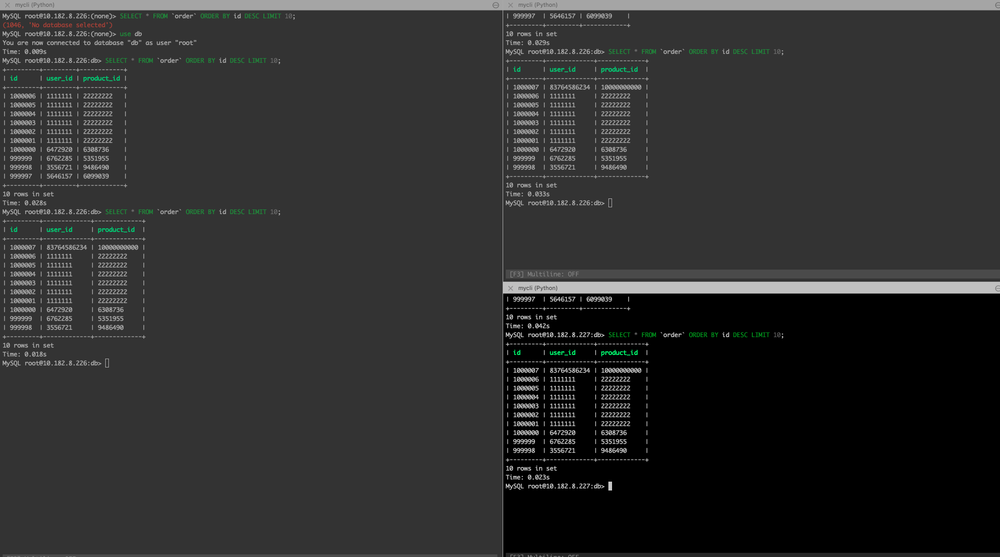

## 第七周作业

* 作业2 - 完成

  由于在第六周的作业当中，设计的订单表有两个外键——分别是用户表中的用户id和商品表中的商品id，单独向订单表中插入数据会面临外键依赖的问题，所以设计新的表，将外键去掉。另外，为了简化实验，将订单表拆分成关键订单表（订单id、用户id、商品id）和订单详情表（订单id...）

  ```sql
  CREATE TABLE IF NOT EXISTS `order` (
      `id` bigint(11) NOT NULL AUTO_INCREMENT COMMENT '订单ID',
      `user_id` bigint(11) NOT NULL COMMENT '用户ID',
      `product_id` bigint(11)NOT NULL COMMENT '商品ID',
      PRIMARY KEY (`id`)
  ) ENGINE=InnoDB DEFAULT CHARSET=utf8mb4 COLLATE=utf8mb4_0900_ai_ci;
  ```

  * 根据课上的提示，有以下写入优化的方向

    1. PreparedStatement 比 Statement 快
    2. Multiple Values / Add Batch 减少交互
    3. 如果在有索引的情况下，有索引的属性数据递增插入更快（这涉及到了InnoDB的实现原理B+树，当数据按递增的顺序依次插入时，数据会尽量地在树的右下角插入，产生的非叶子结点分裂相对较少；相反，数据若没有顺序的随机插入，会导致更多的分裂，这会带来很多的资料的消耗，降低效率）
    4. 相比于有索引依次插入数据，在无索引的情况下，将数据全部导入后再建立索引效率更高。

  * 使用现代科学的基本实验方法 —— 控制变量法

    1. PreparedStatement 和 Statement 比较

       - [x] 单线程
       - [x] 表中有索引 - 主键

       | 方法              | 耗时  | 插入数据量 |
       | ----------------- | ----- | ---------- |
       | Statment          | 445秒 | 1_000_000  |
       | PreparedStatement | 490秒 | 1_000_000  |

       * 单纯使用PreparedStatement在该实验环境背景下，并没有提升写入效率

    2. Add Batch 与 不使用Add Batch

       - [x] 单线程
       - [x] 表中有索引 - 主键
       - [x] 使用 PreparedStatement

       | 方法            | 耗时   | 插入数据量 |
       | --------------- | ------ | ---------- |
       | Add Batch       | 1805ms | 100_000    |
       | 不使用Add Batch | 45s    | 100_000    |

       * 使用Add Batch显著提升效率

    3. 有索引与没有索引

       - [x] 单线程
       - [x] 使用PreparedStatement
       - [x] 使用Add Batch

       * 无索引，建表如下：

         ```sql
         DROP TABLE `order_x`;
         CREATE TABLE IF NOT EXISTS `order_x` (
             `user_id` bigint(11) NOT NULL COMMENT '用户ID',
             `product_id` bigint(11)NOT NULL COMMENT '商品ID'
         ) ENGINE=InnoDB DEFAULT CHARSET=utf8mb4 COLLATE=utf8mb4_0900_ai_ci;
         ```

         ```sql
         # 插入数据后，为表添加自增主键
         ALTER TABLE `order_x` ADD id bigint(11) not null AUTO_INCREMENT PRIMARY KEY COMMENT '订单ID' FIRST; 
         ```

       | 方法   | 耗时   | 插入数据量 |
       | ------ | ------ | ---------- |
       | 有索引 | 1805ms | 100_000    |
       | 无索引 | 1804ms | 100_000    |

       * 在该实验环境背景下，有无索引对写入效率并没有显著影响

    4. Hikari 和 JDBC

       - [x] 单线程
       - [x] 表中有索引 - 主键
       - [x] 使用PreparedStatement
       - [x] 使用Add Batch

       | 方法   | 耗时   | 插入数据量 |
       | ------ | ------ | ---------- |
       | JDBC   | 1805ms | 100_000    |
       | Hikari | 1277ms | 100_000    |

       * 在数据量较少的情况下Hikari的写入效率提升明显

  * 尝试以效率最高的方式插入数据一百万条

    1. 方案A - 插入数据

       - [x] 多线程 - 固定线程池和CountDownLatch
       - [x] Hikari
       - [x] 使用PreparedStatement和Add Batch
       - [x] 表有索引

       * 耗时：9414毫秒，即9秒

    2. 方案B - LoadData

       ```sql
       LOAD DATA LOCAL INFILE '/tmp/initData.txt' INTO TABLE `order` 
       CHARACTER SET utf8mb4
       FIELDS TERMINATED BY '\t'
              LINES TERMINATED BY '\n'
              (`user_id`,`product_id`); 
       ```

       * 很快

* 作业9 - 完成

  * [资源准备](资源准备.md)

    | 主机 | 端口 | 备注 |
    | ---- | ---- | ---- |
    | 226  | 3316 | 主库 |
    | 226  | 3326 | 从库 |
    | 227  | 3336 | 从库 |

    * `user`: root, `password`: root
    * 主库中还有用户用来主从同步：`user`: repl, `password`: 123456

  * 代码在本目录下的week07项目中的`assignment9`目录下

    * 截图展示

    

* 作业10 - 完成

  

