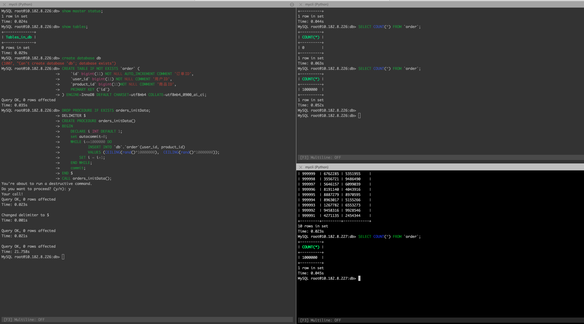

## 资源准备 - 配置一主两从数据库

* 创建数据库实例

  | 主从库 | 端口 | 主机 |
  | ------ | ---- | ---- |
  | 主     | 3316 | 226  |
  | 从     | 3326 | 226  |
  | 从     | 3336 | 227  |

  ```shell
  # 主库创建
  docker run --name mysql_master -p 3316:3306 -e MYSQL_ROOT_PASSWORD=root -e MYSQL_ROOT_HOST=% -d mysql:latest
  
  # 226 - 从库创建
  docker run --name mysql_slave1 -p 3326:3306 -e MYSQL_ROOT_PASSWORD=root -e MYSQL_ROOT_HOST=% -d mysql:latest
  
  # 227 - 从库创建
  docker run --name mysql_slave2 -p 3336:3306 -e MYSQL_ROOT_PASSWORD=root -e MYSQL_ROOT_HOST=% -d mysql:latest
  ```

* 创建库及数据初始化

  * 在主库中执行以下操作

    ```shell
    mysql -h<主机226> -P3316 -uroot -p'root' < init.sql
    ```

    * `init.sql`文件内容如下

    ```sql
    # 建库
    CREATE DATABASE IF NOT EXISTS `db`;
    USE `db`;
    
    # 建表
    CREATE TABLE IF NOT EXISTS `order` (
        `id` bigint(11) NOT NULL AUTO_INCREMENT COMMENT '订单ID',
        `user_id` bigint(11) NOT NULL COMMENT '用户ID',
        `product_id` bigint(11)NOT NULL COMMENT '商品ID',
        PRIMARY KEY (`id`)
    ) ENGINE=InnoDB DEFAULT CHARSET=utf8mb4 COLLATE=utf8mb4_0900_ai_ci;
    
    
    # 插入数据到订单表中
    DROP PROCEDURE IF EXISTS orders_initData;
    DELIMITER $
    CREATE PROCEDURE orders_initData()
    BEGIN
        DECLARE i INT DEFAULT 1;
        set autocommit=0;
        WHILE i<=1000000 DO
                INSERT INTO `db`.`order`(user_id, product_id)
                VALUES (CEILING(rand()*10000000),  CEILING(rand()*10000000));
            SET i = i+1;
        END WHILE;
        commit;
    END $
    CALL orders_initData();
    ```

  * 拷贝数据到从库

    ```shell
    # 首先从主库中备份数据到本地（在sh中提前进入准备好的目录）
    docker exec mysql_master /usr/bin/mysqldump -u root --password=root db > backup.sql
    
    ## 将本地的backup.sql文件传输到slave所在的机器上
    # nc、sftp、scp等
    226> nc <主机227> 9999 < backup.sql
    227> nc -l 9999 > backup.sql
    
    # 在从数据库中也创建一样的库`db`, 可以选择在本地使用mysql连接远程数据库，创建数据库，也可以使用下面的例子
    docker exec -it mysql_slave1 mysql -u root -p'root'
    mysql> create database db;
    docker exec -it mysql_slave2 mysql -u root -p'root'
    mysql> create database db;
    
    # 复制数据到从库中
    cat backup.sql | docker exec -i mysql_slave1 /usr/bin/mysql -u root --password=root db
    cat backup.sql | docker exec -i mysql_slave2 /usr/bin/mysql -u root --password=root db
    ```

* 主从配置

  * 主库

    ```sh
    docker cp ./master.conf mysql_master:/etc/mysql/my.cnf
    docker restart mysql_master
    
    # 进入数据库，查看master的状态，注意下面的File和Position，在从库设置中需要使用
    mysql> CREATE USER 'repl'@'%' IDENTIFIED WITH mysql_native_password  BY '123456';
    mysql> GRANT REPLICATION SLAVE ON *.* TO 'repl'@'%';
    mysql> flush privileges;
    mysql> show master status\G;
    
    *************************** 1. row ***************************
                 File: mysql-bin.000001
             Position: 856
         Binlog_Do_DB: db
     Binlog_Ignore_DB:
    Executed_Gtid_Set:
    ```

  * 从库

    ```sh
    docker cp ./slave1.conf mysql_slave1:/etc/mysql/my.cnf
    docker restart mysql_slave1
    
    # 进入数据库
    mysql> 
    CHANGE MASTER TO
        MASTER_HOST='10.182.8.226',  
        MASTER_PORT = 3316,
        MASTER_USER='repl',      
        MASTER_PASSWORD='123456',   
        MASTER_LOG_FILE='mysql-bin.000001',
        MASTER_LOG_POS=2031;
    mysql> start slave;
    
    # 校验是否配置成功
    mysql> show slave status\G;
    
    ALTER USER 'repl'@'%' IDENTIFIED WITH mysql_native_password BY 'root';
    ```

    * 同理配置mysql_slave2

* 校验在主库中修改数据，在从库中检查是否变化 - 成功

  

  

