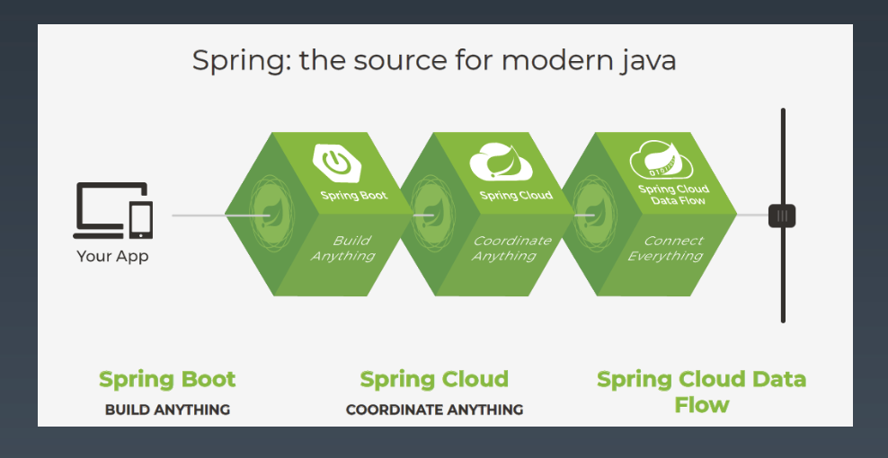

## 1. Spring技术发展

* 背景

  - 2002 年 10 月，Rod Johnson 撰写了一本名为 Expert One-on-One J2EE 设计和开发的 书。Rod，Juergen 和 Yann 于 2003 年 2 月左右开始合作开发Spring项目。
  - ……
  - Pivotal 公司成立之后，于 2014 年发布了 Spring Boot，2015 年发布了 Spring Cloud，2018 年 Pivotal 公司在纽约上市。公司的开源产品有:Spring 以及 Spring 衍生产品、Web 服务器 Tomcat、 缓存中间件 Redis、消息中间件 RabbitMQ、平台即服务的 Cloud Foundry、Greenplum 数据引擎、 GemFire(12306 系统解决方案组件之一)。

  官网提到Spring出现的意义即是使Java更简单。

  > Spring makes Java simple.

  _

  

  

## 2. Spring框架设计*

* __框架是基于一组类库或工具__，在特定领域里根据一定的规则组合成的、开放性的骨架。

  框架具有如下特性:

  1. 支撑性+扩展性:框架不解决具体的业务功能问题，我们可以在框架的基础上添加各种具体的业务功能、定制特性，从而形成具体的业务应用系统。

  2. 聚合性+约束性:框架是多种技术点的按照一定规则的聚合体。我们采用了某种框架也就意味着做出了技术选型的取舍。在很多种可能的技术组合里确定了一种具体的实现方式，后续的其他工作都会从这些技术出发，也需要遵循这些规则，所以框架本身影响到研发 过程里的方方面面。

* Spring framework 6大模块

  _

  

* 引入 Spring 意味着引入了一种研发协作模式

  _

  

## 3. Spring AOP详解*

* AOP-面向切面编程

  Spring早期版本的核心功能: 管理对象生命周期与对象装配。

  为了实现管理和装配，一个自然而然的想法就是，加一个中间层代理(字节码增强)来实现所有对象的托管。

* IoC-控制反转

  

* AOP-面向切面编程

  _

  

## 4. Spring Bean 核心原理*

* Spring Bean 生命周期

  Bean的加载过程

  _

  

  

  

* Bean的加载过程演示

  * 创建对象
  * 属性赋值
  * 初始化
  * 注销接口注册

  _

  

  * 检查Aware装配
  * 前置处理、After处理
  * 调用init method
  * 后置处理

  返回包装类

  _

  

  _

  

## 5. Spring XML 配置原理*

* XML配置原理

  _

  

* 自动化XML配置工具：XmlBeans -> Spring-xbean

  原理：

  1. 根据Bean的字段结构，自动生成XSD
  2. 根据Bean的字段结构，加载XML文件

  思考：

  1. 解析XML的工具有哪些，都有什么特点?
  2. XML <-> Bean相互转换的工具，除了xbean，还有什么?

* Spring Bean 配置方式演化

  _

  

  

## 6. Spring Messaging等技术

* 介绍 Messaging 与 JMS (Java Messaging Service)

  _

  

  _

  

  

