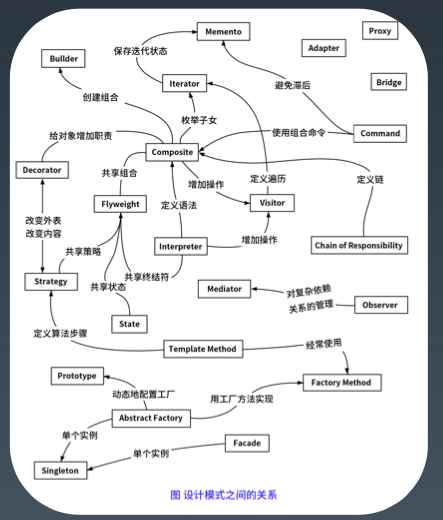
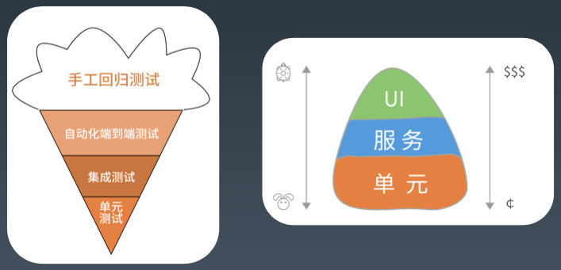
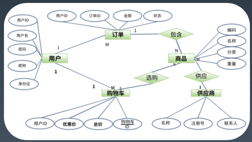
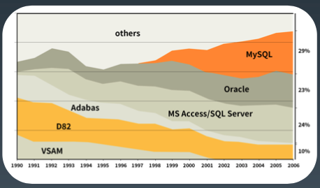
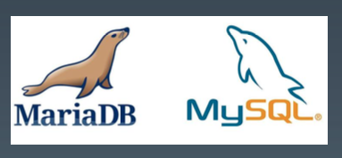
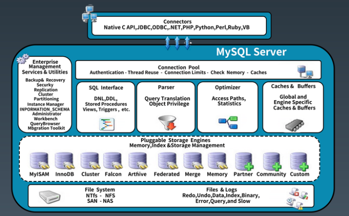
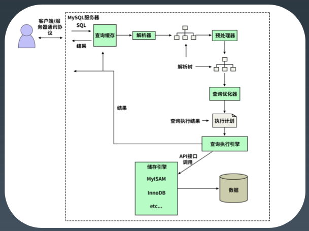
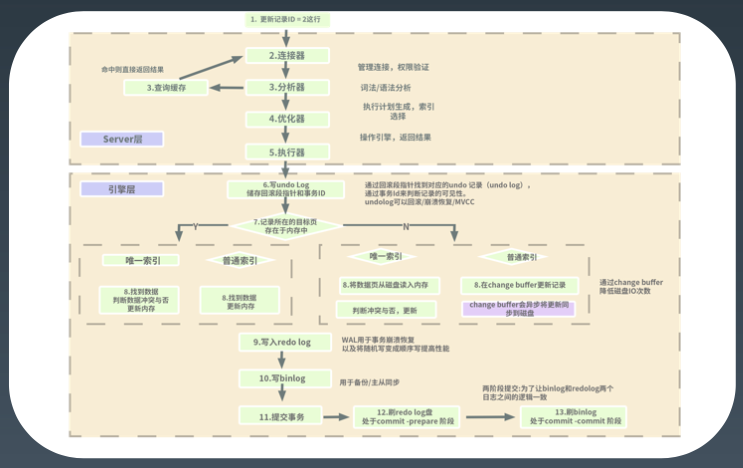
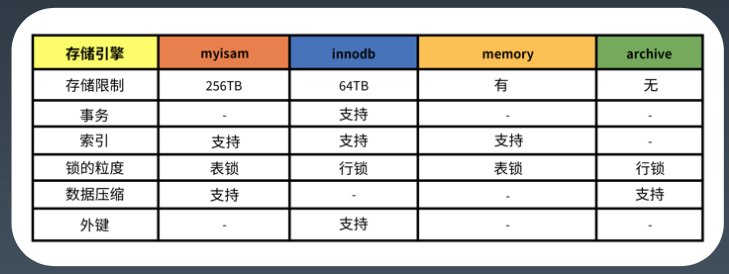
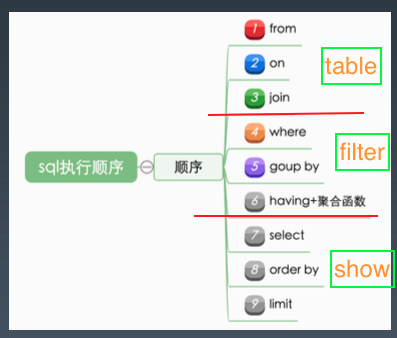

# 0x06-01 Java相关框架


> 晦涩难懂的不是真的知识。

## 1. Java8 Lamdba*

* 什么是Lamdba表达式？
  * Lambda 表达式(lambda expression)是一个匿名函数，Lambda 表达式基于数学中的 $\lambda$​ 演算得名，直接对应于其中的 lambda 抽象(lambda abstraction)，是一个匿名函数，即没有函数名的函数。
  * 面向对象与面向函数。
* 深入Java8函数式
  * @FunctionalInterface
    * Predicate<T> 有参数、条件判断 
    * Function<T, R> 有参数、有返回值
    * Consumer<T> 无返回值 
    * Supplier<T> 无参数、有返回值
* 实验代码及资料
  * 关于Lambda表达式与Stream编程，字母哥在[恕我直言你可能真的不会Java](http://www.zimug.com/category/java/java8/page/2)系列文章中有详细的讲解，其是很好的入门案例。
  * [实验代码](https://github.com/JavaCourse00/JavaCourseCodes/tree/main/04fx/java8/src/main/java/io/kimmking/java8)


## 2. Java8 Stream<sup>*</sup>

* Java集合与泛型 - 泛型也是为了简化编程
  * 什么是泛型? 伪泛型，擦除法
  * 运行期怎么判断有泛型?
  * Lambda 里用泛型
  * 多个泛型约束条件
* 实验代码及资料同上


## 3. Lombok 

* Lombok 是基于 jsr269 实现的一个非常神奇的 java 类库，会利用注解自动生成 java Bean 中烦 人的 get、set 方法及有参无参构造函数，还能自动生成 logger、ToString、HashCode、Builder 等 java 特色的函数或是符合设计模式的方法，能够让你 java Bean 更简洁，更美观。基于字节码增强，编译期处理。
* [实验代码](https://github.com/JavaCourse00/JavaCourseCodes/tree/main/04fx/java8/src/main/java/io/kimmking/java8)


## 4. Guava

* 什么是Guava？

  * Guava 是一种基于开源的 Java 库，其中包含谷歌正在由他们很多项目使用的很多核心库。这个库是为了方便编码，并减少编码错误。这个库提供用于集合，缓存，支持原语，并发性，常见注解， 字符串处理，I/O 和验证的实用方法。

* Guava 的好处

  * 标准化 – Guava 库是由谷歌托管。
  * 高效 - 可靠，快速和有效的扩展 JAVA 标准库。
  * 优化 –Guava 库经过高度的优化。

* Guava 特性

  * 集合[Collections]

    1. 不可变集合:用不变的集合进行防御性编程和性能提升。

    2. 新集合类型:multisets, multimaps, tables, bidirectional maps 等
    3. 强大的集合工具类:提供 java.util.Collections 中没有的集合工具
    4. 扩展工具类:让实现和扩展集合类变得更容易，比如创建 Collection 的装饰器，或实现迭代器

  * 缓存[Caches]

    * 本地缓存实现，支持多种缓存过期策略

  * 并发[Concurrency]

    * ListenableFuture:完成后触发回调的 Future

  * 字符串处理[Strings]

    * 非常有用的字符串工具，包括分割、连接、填充等操作

  * 事件总线[EventBus]

    * 发布-订阅模式的组件通信，进程内模块间解耦

  * 反射[Reflection]

    * Guava 的 Java 反射机制工具类

* [实验代码](https://github.com/JavaCourse00/JavaCourseCodes/tree/main/04fx/java8/src/main/java/io/kimmking/java8)

  

## 5. 设计原则<sup>*</sup>

* 面向对象设计原则 SOLID

  1. SRP: The Single Responsibility Principle 单一责任原则
  2. OCP: The Open Closed Principle 开放封闭原则
  3. LSP: The Liskov Substitution Principle 里氏替换原则
  4. ISP: The Interface Segregation Principle 接口分离原则
  5. DIP:The Dependency Inversion Principle 依赖倒置原则

  > 最小知识原则/KISS，高内聚低耦合

* 编码规范、checkstyle

  * 为什么需要编码规范吗？
  * 常见的编码规范：
    1. Google 编码规范: https://google.github.io/styleguide/javaguide.html
    2. Alibaba 编码规范: https://github.com/alibaba/p3c
    3. VIP 规范: https://vipshop.github.io/vjtools/#/standard/

  

  __编码规范还是很有必要的！__ 


## 6. 设计模式<sup>*</sup>

* GoF 23 设计模式

  * 本质是一类特定场景下通用解决经验。

  * 创建型

    1. Factory Method(工厂方法)
    2. Abstract Factory(抽象工厂)
    3. Builder(建造者)
    4. Prototype(原型)
    5. Singleton(单例)

  * 结构型

    6. Adapter(适配器)
    7. Bridge(桥接)
    8. Composite(组合)
    9. Decorator(装饰)
    10. Facade(外观)
    11. Flyweight(享元)
    12. Proxy(代理)

  * 行为型

    13. Interpreter(解释器)
    14. Template Method(模板方法)
    15. Chain of Responsibility(责任链)
    16. Command(命令)
    17. Iterator(迭代器)
    18. Mediator(中介者)
    19. Memento(备忘录)
    20. Observer(观察者)
    21. State(状态)
    22. Strategy(策略)
    23. Visitor(访问者)

    -

  

* 设计模式与反模式

  * 模式的3个层次：解决方案层面（架构模式），组件层面（框架模式），代码层面（GoF设计模式）
  * 其他模式：集成模式，事务模式，IO 模式/Context 模式，甚至状态机 FSM，规则引擎 RE，workflow 都是模式。
  * 反模式：死用模式，都是反模式。


## 7. 单元测试<sup>*</sup>

* 什么是单元测试

  -

  

* 如何做单元测试

  * JUnit -> TestCase, TestSuite, Runner

  * SpringTest
  * Mock技术
    - Mockito
    - easyMock
  * 测试原则
    1. 单元测试方法应该每个方法是一个 case，断言充分，提示明确
    2. 单测要覆盖所有的 corner case
    3. 充分使用 mock(一切皆可 mock)
    4. 如果发现不好测试，则说明业务代码设计存在问题，可以反向优化代码
    5. 批量测试用例使用参数化单元测试
    6. 注意测试是单线程执行
    7. 合理使用 before, after, setup 准备环境
    8. 合理使用通用测试基类
    9. 配合 checkstyle，coverage 等工具
    10. 制定单元测试覆盖率基线

* 单元测试的常见陷阱与经验

  1. 尽量不要访问外部数据库等外部资源
  2. 如果必须用数据库考虑用嵌入式 DB+ 事务自动回滚
  3. 防止静态变量污染导致测试无效
  4. 小心测试方法的顺序导致的不同环境测试失败
  5. 单元测试总时间特别长的问题


# 0x06-02 性能与SQL优化


## 1. 再聊聊性能优化

* 复习一下什么是性能？
  - 吞吐与延迟：有些结论是反直觉的，指导我们关注什么
  - 没有量化就没有改进：监控与度量指标，指导我们怎么去入手
  - 80/20原则：先优化性能瓶颈问题，指导我们如何去优化
  - 过早的优化是万恶之源：指导我们要选择优化的时机
  - 脱离场景谈性能都是耍流氓：指导我们对性能要求要符合实际
* DB/SQL优化是业务系统性能优化的核心
  * 业务系统的分类：计算密集型、数据密集型
  * 业务处理本身无状态，数据状态最终要保存到数据库
  * 一般来说，DB/SQL 操作的消耗在一次处理中占比最大
  * 业务系统发展的不同阶段和时期，性能瓶颈要点不同，类似木桶装水


## 2. 关系数据库 MySQL<sup>*</sup>

* 什么是关系数据库？

  * 1970年 Codd 提出关系模型，以关系代数理论为数学基础

    《A Relational Model of Data for Large Shared Data Banks》

* E-R 图

  -

  

* 数据库设计范式

  * 第一范式（1NF）：数据库表每一列都是不可分割的基本数据项，即保证每列原子性
  * 第二范式（2NF）：在满足1NF的基础上，确保表中的每一列都和主键有关，而不能只与主键的某一部分有关（主要针对联合主键而言）
  * 第三范式（3NF）：在满足2NF的基础上，消除传递依赖，确保表中的每一列都与主键直接关联
  * BC范式（Boyce-Codd NF）：在满足3NF的基础上，消除主属性对码的部分和传递函数依赖
  * 第四范式（4NF）：消除非平凡的多值依赖
  * 第五范式(5NF)：消除一些不合适的连接依赖

* 常见关系数据库

  * 开源：MySQL、PostgreSQL

  * 商业：Oracle，DB2，SQL Server

    

  * 内存数据库：Redis？，VoltDB

  * 图数据库：Neo4j，Nebula

  * 时序数据库：InfluxDB，openTSDB

  * 其他关系数据库：Access，Sqlite，H2，Derby，Sybase，Infomix等

  * NoSQL数据库：MongoDB、Hbase、Cassandra、CouchDB

  * NewSQL/分布式数据库：TiDB、CockroachDB、NuoDB、OpebGauss、OB、TDSQL

  -

  

* SQL语言

  * 背景

    * SQL 语言1974年由 Boyce 和 Chamberlin 提出，并首先在 IBM 公司研制的关系数据库系统 SystemR上实现。
    * 1979年 ORACLE 公司首先提供商用的 SQL，IBM 公司在 DB2 和 SQL/DS 数据库系统中也实现了 SQL。
    * 1986年10月，美国 ANSI 采用 SQL 作为关系数据库管理系统的标准语言(ANSI X3. 135-1986)，后为 国际标准化组织(ISO)采纳为国际标准。
    * 1989年，美国 ANSI 采纳在 ANSI X3.135-1989报告中定义的关系数据库管理系统的 SQL 标准语言，称为 ANSI SQL 89，该标准替代 ANSI X3.135-1986版本。

  * 结构化查询语言包含6个部分：

    1. 数据查询语言(DQL: Data Query Language)：其语句，也称为“数据检索语句”，用以从表中获得数据，确定数据怎样在应用程序给出。保留字 SELECT 是 DQL(也是所有 SQL)用得最多的动词，其他 DQL 常用的保留字 有 WHERE，ORDER BY，GROUP BY 和 HAVING。这些 DQL 保留字常与其它类型的 SQL 语句一起使用。
    2. 数据操作语言(DML: Data Manipulation Language)：其语句包括动词 INSERT、UPDATE 和 DELETE。它 们分别用于添加、修改和删除。
    3. 事务控制语言(TCL): 它的语句能确保被 DML 语句影响的表的所有行及时得以更新。包括COMMIT(提交) 命令、SAVEPOINT(保存点)命令、ROLLBACK(回滚)命令。
    4. 数据控制语言(DCL): 它的语句通过 GRANT 或 REVOKE 实现权限控制，确定单个用户和用户组对数据库对象 的访问。某些 RDBMS<sup>1</sup>可用 GRANT 或 REVOKE 控制对表单个列的访问。
    5. 数据定义语言(DDL): 其语句包括动词 CREATE,ALTER 和 DROP。在数据库中创建新表或修改、删除表 (CREAT TABLE 或 DROP TABLE);为表加入索引等。
    6. 指针控制语言(CCL): 它的语句，像 DECLARE CURSOR，FETCH INTO 和 UPDATE WHERE CURRENT 用于对 一个或多个表单独行的操作。

    * 注1：RDBMS - Relational Data Base Management System 

  * SQL的各个版本：

    * 1986年，ANSI X3.135-1986，ISO/IEC 9075:1986，SQL-86
    * 1989年，ANSI X3.135-1989，ISO/IEC 9075:1989，SQL-89 
    * 1992年，ANSI X3.135-1992，ISO/IEC 9075:1992，SQL-92(SQL2) 
    * 1999年，ISO/IEC 9075:1999，SQL:1999(SQL3)
    * 2003年，ISO/IEC 9075:2003，SQL:2003
    * 2008年，ISO/IEC 9075:2008，SQL:2008
    * 2011年，ISO/IEC 9075:2011，SQL:2011

* MySQL数据库

  * 背景：

    * 瑞典的MySQL AB创立与1995年

    * 2008年1月16日 MySQL AB 被 Sun Microsystems 收购。

    * 2009年4月20日，甲骨文(Oracle)收购 Sun Microsystems 公司。

    * 其后分离成两个版本: MariaDB 和 MySQL

      -

    

* MySQL的版本

  * 4.0支持 InnoDB，事务
  * 2003年，5.0
  * 5.6 ==> 历史使用最多的版本
  * 5.7 ==> 近期使用最多的版本
  * 8.0 ==>最新和功能完善的版本

  > 我们生产环境使用的基本都是5.7这个版本，个人学习可以选择探索一下8.0的新特性。

* MySQL版本差异
  * 5.6/5.7的差异
    - 多主
    - MGR高可用
    - 分区表
    - json
    - 性能
    - 修复XA等
  * 5.7/8.0的差异
    - 通用表达式
    - 窗口函数
    - 持久化参数
    - 自增列持久化
    - 默认编码 utf8mb4
    - DDL 原子性
    - JSON 增强
    - 不再对 group by 进行隐式排序??==> 坑


## 3. 深入数据库原理<sup>*</sup>

* MySQL架构图

  -

  

* MySQL存储

  * 独占模式
    1. 日志组文件：ib_logfile0和ib_logfile1,默认均为5M
    2. 表结构文件：*.frm
    3. 独占表空间文件：*.ibd
    4. 字符集和排序规则文件：db.opt
    5. binlog二进制日志文件：记录主数据库服务器的DDL和DML操作
    6. 二进制日志索引文件：master-bin.index
  * 共享模式 innodb_file_per_table=OFF
    1. 数据都在ibdata1

* MySQL 简化执行流程

  -

  

  -

  

* MySQL执行引擎和状态

  -

  

* MySQL对SQL执行顺序

  -

  

  * 实际上这个过程也并不是绝对这样的，中间 mysql 会有部分的优化以达到最佳的优化效 果，比如在 select 筛选出找到的数据集

* MySQL 索引原理

  * B+树，数据存放在叶子节点上，主键B+树叶子节点上存放的是数据（聚簇索引），非聚簇索引存放的是索引字段+主键

  * 数据按页分块，每页16K，每个节点就是一个页
  * 为什么一般单表数据不超过2000万？

* MySQL 数据库操作演示

  * 安装的几种方式，安装文件或命令，docker
  * 操作工具，mycli或IDE(DataGrip,MySQL-WorkBench,MySQL-Front,Navicat 等)
  * MySQL 库结构，操作语句与命令
  * MySQL SQL 语法演示
  * 5.6/5.7/8.0


## 4. MySQL 配置优化<sup>*</sup>

* 查看参数配置

  ```sql
  show variables like xxx;
  
  # my.cnf文件 // windows中是my.ini
  # [mysqld]
  # server
  
  # [mysql]
  # client
  ```

* 参数配置优化

  - 连接请求的变量
    1. max_connections
    2. back_log
    3. wait_timeout和interative_timeout
  - 缓冲区优化
    1. key_buffer_size
    2. query_cache_size(查询缓存简称 QC)
    3. max_connect_errors
    4. sort_buffer_size
    5. max_allowed_packet=32M
    6. join_buffer_size=2M
    7. thread_cache_size=300
  - 配置 Innodb 的几个变量
    1. innodb_buffer_pool_size=128M
    2. innodb_flush_log_at_trx_commit
    3. innodb_thread_concurrency=0
    4. innodb_log_buffer_size
    5. innodb_log_file_size=50M
    6. innodb_log_files_in_group=3
    7. read_buffer_size=1M
    8. read_rnd_buffer_size=16M
    9. bulk_insert_buffer_size=64M
    10. binary log


## 5. 数据库设计优化<sup>*</sup>

* MySQL 数据库设计优化 - 最佳实践

  * 如何恰当选择引擎？
  * 库表如何命名?
  * 如何合理拆分宽表?
  * 如何选择恰当数据类型:明确、尽量小
    *  char、varchar 的选择
    * (text/blob/clob)的使用问题?
    * 文件、图片是否要存入到数据库?
    * 时间日期的存储问题? BigInt规避时区的影响
    * 数值的精度问题?
  * 是否使用外键、触发器?
  * 唯一约束和索引的关系?
  * 是否可以冗余字段?
  * 是否使用游标、变量、视图、自定义函数、存储过程?
  * 自增主键的使用问题?
  * 能够在线修改表结构(DDL 操作)?
  * 逻辑删除还是物理删除?
  *  要不要加 create_time,update_time 时间戳?
  * 数据库碎片问题?
  * 如何快速导入导出、备份数据?

  > 性能是一个综合性问题


