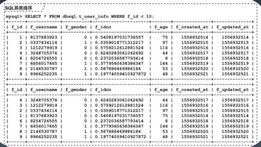
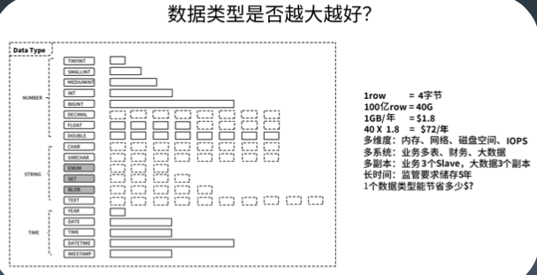
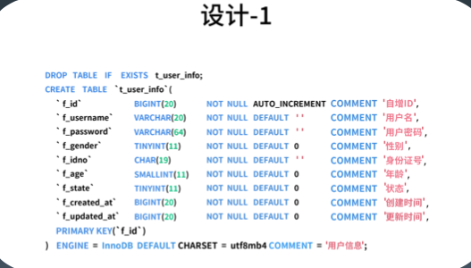
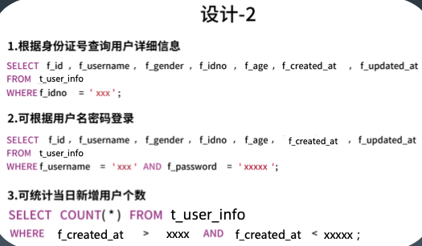
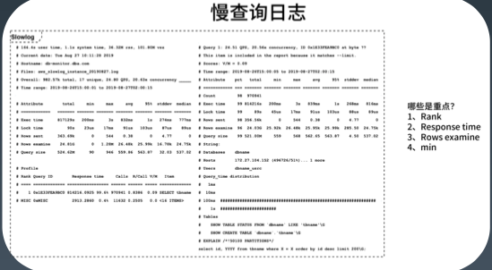
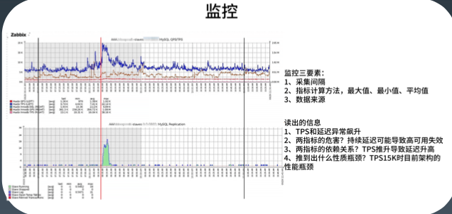
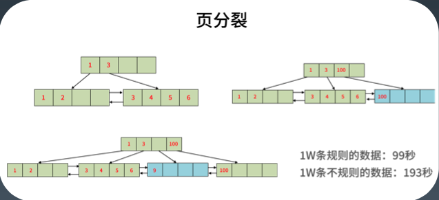
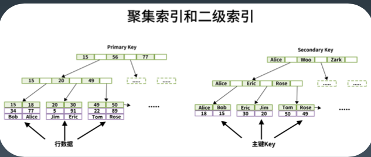
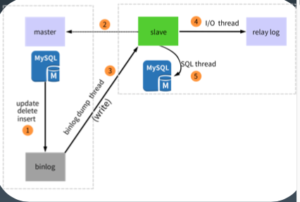

# 0x07-01 系统性能优化


> 工欲善其事，必先利其器！ 学会使用工具可以提升工作效率。


## 1. MySQL 事务与锁<sup>*</sup>

* 事务可靠性ACID：

  * Atomicity: 原子性，一次事务中的操作要么全部成功，要么全部失败。

  * Consistency: 一致性，保证事务只能把数据库从一个有效（正确）的状态“转移”到另一个有效（正确）的状态。什么是数据库的有效(正确）的状态？

    > Consistency ensures that a transaction can **only bring the database from one valid state to another**, maintaining database [invariants](https://link.zhihu.com/?target=https%3A//en.wikipedia.org/wiki/Invariant_(computer_science)): **any data written to the database must be valid according to all defined rules, including [constraints](https://link.zhihu.com/?target=https%3A//en.wikipedia.org/wiki/Integrity_constraints), [cascades](https://link.zhihu.com/?target=https%3A//en.wikipedia.org/wiki/Cascading_rollback),[triggers](https://link.zhihu.com/?target=https%3A//en.wikipedia.org/wiki/Database_trigger), and any combination thereof.** This prevents database corruption by an illegal transaction, but does **not guarantee that a transaction is *correct*.**

  * Isolation：隔离性，可见性，保护事务不会互相干扰，包含4种隔离级别。

  * Durability： 持久性，事务提交成功后，不会丢数据。如电源故障，系统崩溃。

  > 关于一致性的理解：应用系统从一个正确的状态到另一个正确的状态，而ACID就是说事务能够通过AID来保证这个C的过程。C是目的，AID都是手段。

  * InnoDB：
    - 双写缓冲区、故障恢复、操作系统、fsync() 、磁盘存储、缓存、UPS、网络、备份策略 ......

* InnoDB Locking

  > 关于锁， [官网](https://dev.mysql.com/doc/refman/5.7/en/innodb-locking.html) 给出了详细的说明

  -

  

  * Shared and Exclusive Locks - row-level locks
    * A [shared (`S`) lock](https://dev.mysql.com/doc/refman/5.7/en/glossary.html#glos_shared_lock) permits the transaction that holds the lock to read a row.
    * An [exclusive (`X`) lock](https://dev.mysql.com/doc/refman/5.7/en/glossary.html#glos_exclusive_lock) permits the transaction that holds the lock to update or delete a row.
  * Intention Locks - *multiple granularity locking*

  * 表级锁

    * 意向锁: 表明事务稍后要进行哪种类型的锁定
      * 共享意向锁(IS): 打算在某些行上设置共享锁
      * 排他意向锁(IX): 打算对某些行设置排他锁
      * Insert 意向锁: Insert 操作设置的间隙锁
    * 其他
      * 自增锁(AUTO-IN)
      * LOCK TABLES/DDL

    

    -

    

    ```sql
    SHOW ENGINE INNODB STATUS;
    ```

  * 行级锁

    * 记录锁(Record): 始终锁定索引记录，注意隐藏的聚簇索引
    * 间隙锁(Gap): 锁住一个范围
    * 临键锁(Next-Key): 记录锁+间隙锁的组合;可“锁定”表中不存在记录
    * 谓词锁(Predicat): 空间索引

  * 死锁

    * 阻塞与互相等待
    * 增删改、锁定读
    * 死锁检测与自动回滚
    * 锁粒度与程序设计

* 事务的隔离级别 - Transaction Isolation Level

  * 并发事务带来的问题：
    1. 脏读
    2. 不可重复读
    3. 幻读

  * 《SQL:1992标准》规定了四种事务隔离级别(Isolation):

    1. 读未提交: READ UNCOMMITTED

       * 很少使用

       * 不能保证一致性

       * 脏读(dirty read) : 使用到从未被确认的数据(例如: 早期版本、回滚)

         

       * 锁：

         * 以非锁定方式执行
         * 可能的问题: 脏读、幻读、不可重复读

    2. 读已提交: READ COMMITTED

       * 每次查询都会设置和读取自己的新快照。

       * 仅支持基于行的 bin-log

       * UPDATE 优化: 半一致读(semi-consistent read)

       * 不可重复读: 不加锁的情况下, 其他事务 UPDATE 或 DELETE 会对查询结果有影响

       * 幻读(Phantom): 加锁后, 不锁定间隙，其他事务可以 INSERT

         

       * 锁：

         * 锁定索引记录, 而不锁定记录之间的间隙
         * 可能的问题: 幻读、不可重复读

    3. 可重复读: REPEATABLE READ

       * InnoDB 的默认隔离级别

       * 使用事务第一次读取时创建的快照

       * 多版本技术

         

       * 锁：

         * 使用唯一索引的唯一查询条件时，只锁定查找到的索引记录, 不锁定间隙。

         * 其他查询条件，会锁定扫描到的索引范围，通过间隙锁或临键锁来阻止其他会话在这

           个范围中插入值。

         * 可能的问题: InnoDB 不能保证没有幻读，需要加锁

    4. 可串行化: SERIALIZABLE

       * 最严格的级别，事务串行执行，资源消耗最大

  * [图解 MySQL 事务隔离级别](https://zhuanlan.zhihu.com/p/102883333)

  * 其他：

    * 事务隔离是数据库的基础特征。

    * 可以设置全局的默认隔离级别
    * 可以单独设置会话的隔离级别
    * InnoDB 实现与标准之间的差异

  * -

    
    
  * 问题回顾:

    * 脏读(dirty read) : 使用到从未被确认的数据(例如: 早期版本、回滚)
    * 不可重复读(unrepeated read): 不加锁的情况下，其他事务 update 会对结果集有影响
    * 幻读(phantom read): 相同的查询语句，在不同的时间点执行时，产生不同的结果集不同

* 日志 (`undo log`和`redo log`)

  * `undo log`: 撤销日志
    * 保证事务的原子性
    * 用处：事务回滚，一致性读、崩溃恢复
    * 记录事务回滚时所需的撤消操作
    * 一条 INSERT 语句，对应一条 DELETE 的 undo log
    * 每个 UPDATE 语句，对应一条相反 UPDATE 的 undo log
    * 保存位置：
      * system tablespace(MySQL 5.7 默认)
      * undo tablespaces(MySQL 8.0 默认)
    * 回滚段（rollback segment）
  * `redo log`: 重做日志
    * 确保事务的持久性，防止事务提交后数据未刷新到磁盘就掉线或崩溃
    * 事务执行过程中写入 redo log，记录事务对数据页做了哪些修改。
    * 提升性能: WAL(Write-Ahead Logging) 技术，先写日志，再写磁盘
    * 日志文件: ib_logfile0, ib_logfile1
    * 日志缓冲: innodb_log_buffer_size
    * 强刷: fsync()

  -

  

* MVCC：Multi-Version Concurrency Control （多版本并发控制）

  * 使 InnoDB 支持一致性读: READ COMMITTED 和 REPEATABLE READ
  * 让查询不被阻塞、无需等待被其他事务持有的锁，这种技术手段可以增加并发性能
  * InnoDB 保留被修改行的旧版本
  * 查询正在被其他事务更新的数据时，会读取更新之前的版本
  * 每行数据都存在一个版本号, 每次更新时都更新该版本
  * 这种技术在数据库领域的使用并不普遍。 某些数据库, 以及某些 MySQL 存储引擎都不支持

  > 聚簇索引的更新 = 替换更新
  >
  > 二级索引的更新 = 删除+新建

* MVCC 实现机制

  * 隐藏列

  * 事务链表， 保存还未提交的事务，事务提交则会从链表中摘除

  * Read view: 每个 SQL 一个, 包括 rw_trx_ids, low_limit_id, up_limit_id, low_limit_no 等

  * 回滚段: 通过 undo log 动态构建旧版本数据

    | 隐藏列 | DB_TRX_ID                       | DB_ROLL_PTR                               | DB_ROW_ID              |
    | ------ | ------------------------------- | ----------------------------------------- | ---------------------- |
    | 长度   | 6-byte                          | 7-byte                                    | 6-byte                 |
    | 说明   | 指示最后插入或更新该行的事务 ID | 回滚指针。指向回滚段中写入的undo log 记录 | 聚簇 row ID/ 聚簇 索引 |

* 演示事务与锁

  - 这里仅展示实验的部分截图，相关实验可以自行 Baidu 或 Google 复现。

  - 一些可能会用到的命令：

    ```sql
    SELECT CONNECTION_ID();
    SHOW ENGINE INNODB STATUS;
    SELECT * FROM performance_schema.data_locks;
    SHOW PROCESSLIST
    ```

    -

    

    -

    


## 2. DB 与 SQL 优化

* 从一个简单例子讲起

  -

  

  ```sql
  SELECT f_id, f_username, f_gender, f_idno, f_age, f_created_at, f_updated_at
  FROM dbsql.t_user_info
  WHERE f_id < 10
  ORDER BY IF(f_id < 5, -f_id, f_id);
  ```

* 说说 SQL 优化

  * 如何发现需要优化的 SQL？
  * 你了解的 SQL 优化方法有哪些？
  * SQL 优化有哪些好处？

* 模拟一个需求：

  * 虚拟业务组：

    * 业务分析人员: Tony
    * 开发攻城狮: Micheal
    * 著名DBA: Tijana
    * 此三人是某项目组的核心人员，承接了一个大型系统中某些模块的设计开发工作

  * 需求-1

    * 增加可以保存用户信息的数据表，必要的用户信息包含:

      > 表名:user_info
      >
      > 用户名 username 
      > 密码 password
      > 姓名 name
      > 性别 gender 
      > 身份证号 id_number
      > 年龄 age
      > 状态 state

      * 数据类型是否越大越好？

        -

        

      * 存储引擎的选择

        | InnoDB                                                 | ToKuDB                                                       |
        | ------------------------------------------------------ | ------------------------------------------------------------ |
        | 1. 聚焦索引<br/>2. 锁粒度是行锁<br/>3. InnoDB 支持事务 | 1. 高压缩比，尤其适用于压缩和归档(1:12) <br/>2. 在线添加索引，不影响读写操作<br/>3. 支持完整的 ACID 特性和事务机制 |
        | 没有其他特别因素就用 InnoDB                            | 归档库                                                       |

      * 设计的规范

        -

        

        * 设计表之前，通读 DBA 的指导手册/dbaprinciples

  * 需求-2

    >1.根据身份证号查询用户详细信息
    >
    >2.根据用户名密码登陆
    >
    >3.统计当日新增用户个数

    -

    

    * 小心隐式转换
      * 简单的 SQL 可能带来大的问题，where 条件中注意数据类型，避免类型转换

  * 需求-3

    > 系统经过一个月的运行，用户表增长约100万，DBA 接到告警， CPU 升高，查询越来越慢，请定位问题并给出解决方案。

    * 定位问题的方法：

      - 慢查询日志

        -

        

      - 看应用和运维的监控

        -

        

        -

        

    * 解决方案 

      * 通过查询日志吗，发现慢查询的SQL

      * 增加索引

        ```sql
        alter table table_name add index index_name(column_list);
        ```

      * 索引类型

        * Hash
        * B Tree/ B+ Tree

* 一些思考

  * 为什么主键要单调递增？
    * 避免过多的结点分裂

      -

      

  * 索引思考题

    * 为什么不适用 hash index
    * 为什么 b+tree 更适合做索引
    * 为什么主键长度不能过大

  * 谁快？ 为什么？

    > select * from t_user_info where f_id = XXX  // f_id:primary key
    >
    > select * from t_user_info where f_username=’XXX’  // f_username:index

    -

    

  * 字段选择性-最左原则

    * 某个字段其值的重复程度，称为该字段的选择性
    * F = DISTINCT(col)/count(*)

    -

    

  * 索引冗余

    > (username, name, age) : (username)、 (username, name)
    >
    > (username, name) : (username)、 (name, username)、 (name)
    >
    > (username): (username，id)

    * 长的包括短的，形成冗余
    * 有唯一约束的，组合冗余

  * 修改表结构的危害

    1. 索引重建
    2. 锁表
    3. 抢占资源
    4. 主从延时

  * 数据量

    1. 业务初期考虑不周，字段类型使用不合理，需要变更数据类型
    2. 随着业务的发展，需要增加新的字段
    3. 在无索引字段增加新的业务查询，需要增加索引

* 经验总结

  1. 写入优化
     * 大批量写入的优化
     * PreparedStatement 减少 SQL 解析
     * Multiple Values/Add Batch 减少交互
     * Load Data，直接导入
     * 索引和约束问题
  2. 数据更新
     * 数据的范围更新
     * 注意 GAP Lock 的问题
     * 导致锁范围扩大
  3. 模糊查询
     * Like 的问题
     * 前缀匹配
     * 否则不走索引
     * 全文检索
     * solr/ES
  4. 连接查询
     * 连接查询优化
     * 驱动表的选择问题
     * 避免笛卡尔积
  5. 索引失效
     * 索引失效的情况汇总
     * NULL，not，not in，函数等
     * 减少使用 or，可以用 union(注意 union all 的区别)，以及前面提到的 like
     * 大数据量下，放弃所有条件组合都走索引的幻想，出门左拐“全文检索”
     * 必要时可以使用 force index 来强制查询走某个索引
  6. 查询 SQL 到底怎么设计？
     * 查询数据量和查询次数的平衡
     * 避免不必须的大量重复数据传输
     * 避免使用临时文件排序或临时表
     * 分析类需求，可以用汇总表

## 3. 常见场景分析

* 怎么实现主键 ID

  - 自增
  - sequence
  - 模拟 seq
  - UUID
  - 时间戳/随机数
  - snowflake

* 高效分页

  - 分页:count/pageSize/pageNum, 带条件的查询语句
  - 常见实现-分页插件:使用查询 SQL，嵌套一个 count，性能的坑?
  - 改进一下1，重写 count
  - 大数量级分页的问题，limit 100000,20
  - 改进一下2，反序
  - 继续改进3，技术向:带 id
  - 继续改进4，需求向:非精确分页
  - 所有条件组合? 索引?

* 乐观锁与悲观锁

  ```sql
  select * from xxx for update;
  update xxx;
  commit;
  ```

  * 意味着什么？

  ```sql
  select * from xxx;
  update xxx where value=oldValue;
  ```

  * 为什么叫乐观锁


# 0x07-02 超越分库分表-高可用与读写分离


## 1. 从单机到集群

* 单机 MySQL 数据库的几个问题

  * 随着数据量的增大，读写并发的增加，系统可用性要求的提升，单机 MySQL 面临:
    1. 容量有限，难以扩容
    2. 读写压力，QPS 过大，特别是分析类需求会影响到业务事务
    3. 可用性不足，宕机问题

* 单机 MySQL 的技术演进

  -

  


## 2. MySQL 主从复制<sup>*</sup>

* 主从复制原理 - 核心

  * 核心：

    1. 主库写 binlog
    2. 从库 relay log

    -

    

  * 背景：

    * 2000年，MySQL 3.23.15版本引入了复制
    * 2002年，MySQL 4.0.2版本分离 IO 和 SQL 线程，引入了 relay log
    * 2010年，MySQL 5.5版本引入半同步复制
    * 2016年，MySQL 在5.7.17中引入 InnoDB Group Replication

* 


## 3. MySQL 读写分离<sup>*</sup>


