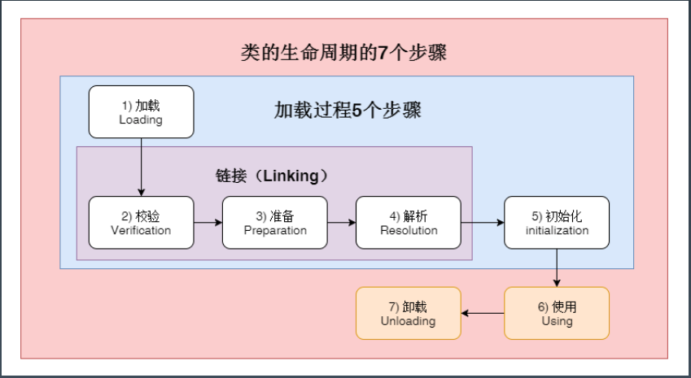
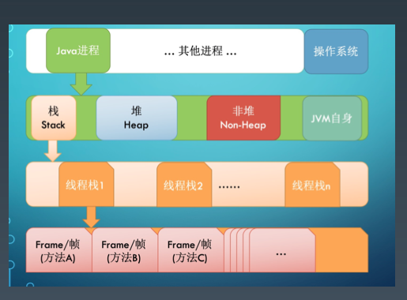
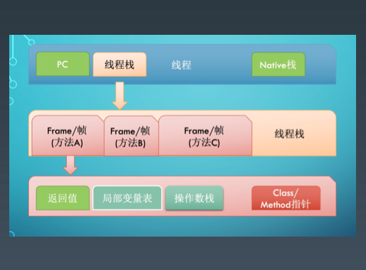
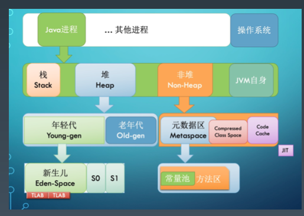
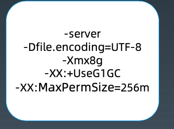

## Java字节码技术

* Java bytecode由单字节（byte）的指令组成，理论上最多支持256个操作码（opcode）

* 生成字节码文件

  ```shell
  编译：javac demo/jvm0104/HelloByteCode.java
  查看字节码：javap -c demo.jvm0104.HelloByteCode
  					javap -c -verbose demo.jvm0104.HelloByteCode
  ```

* JVM 是一台基于栈的计算机器

  * 每个线程都有一个独属于自己的线程栈(JVM Stack)，用于存储栈帧(Frame)。
  * **每一次方法调用、JVM 都会自动创建一个栈帧**。
  * 栈帧由操作数栈、 局部变量数组以及一个 Class 引用组成。
  * Class 引用指向当前方法在运行时常量池中对应的 Class。

## JVM 类加载器

*  类的生命周期

  

  1. 加载(Loading):找 Class 文件
  2. 验证(Verification):验证格式、依赖
  3. 准备(Preparation):静态字段、方法表
  4. 解析(Resolution):符号解析为引用
  5. 初始化(Initialization):构造器、静态变量赋值、静态代码块
  6. 使用(Using)
  7. 卸载(Unloading)

* 三类加载器
  1. 启动类加载器(BootstrapClassLoader) 
  2. 扩展类加载器(ExtClassLoader)
  3. 应用类加载器(AppClassLoader)
* 加载器特点: 
  1. 双亲委托 
  2. 负责依赖 
  3. 缓存加载
* <big>__添加引用类的几种方式__</big>
  1. 放到 JDK 的 lib/ext 下，或者 -Djava.ext.dirs
  2.  java-cp/classpath 或者 class 文件放到当前路径
  3. 自定义 ClassLoader 加载
  4. 拿到当前执行类的 ClassLoader，反射调用 addUrl 方法添加 Jar 或路径(JDK9 无效

## JVM内存模型

* JVM内存结构

  

  

  

## JVM启动参数

* 启动参数

  

  * 以 - 开头为标准参数，所有的 JVM 都要实现这些 参数，并且向后兼容。
  * -D 设置系统属性。
  * 以 -X 开头为非标准参数， 基本都是传给 JVM 的， 默认 JVM 实现这些参数的功能，但是并不保证所 有 JVM 实现都满足，且不保证向后兼容。 可以使 用 java -X 命令来查看当前 JVM 支持的非标准参 数。
  * 以 –XX:开头为非稳定参数, 专门用于控制 JVM的 行为，跟具体的 JVM 实现有关，随时可能会在下 个版本取消。
  * -XX:+-Flags 形式, +- 是对布尔值进行开关。 
  * -XX:key=value 形式, 指定某个选项的值。

* 

  1. 系统属性参数

     * 例如：-Dfile.encoding=UTF-8, -Duser.timezone=GMT+08, -Dmaven.test.skip=true, -Dio.netty.eventLoopThreads=8
     * 相当于System.setProperty("a", "A100"); String a=System.getProperty("a");

  2. 运行模式参数

     * -server：设置 JVM 使用 server 模式，特点是启动速度比较慢，但运行时性能和内存管理效率很高，适用于生产环境。在具有 64 位能力的 JDK 环境下将默认启用该模式，而忽略 -client 参 数。
     * -client：JDK1.7 之前在32位的 x86 机器上的默认值是 -client 选项。设置 JVM 使用 client 模 式，特点是启动速度比较快，但运行时性能和内存管理效率不高，通常用于客户端应用程序或 者 PC 应用开发和调试。此外，我们知道 JVM 加载字节码后，可以解释执行，也可以编译成本 地代码再执行，所以可以配置 JVM 对字节码的处理模式。
     * -Xint：在解释模式(interpreted mode)下运行，-Xint 标记会强制 JVM 解释执行所有的字节 码，这当然会降低运行速度，通常低10倍或更多。
     * -Xcomp：-Xcomp 参数与-Xint 正好相反，JVM 在第一次使用时会把所有的字节码编译成本地 代码，从而带来最大程度的优化。【注意预热】
     * -Xmixed：-Xmixed 是混合模式，将解释模式和编译模式进行混合使用，有 JVM 自己决定，这 是 JVM 的默认模式，也是推荐模式。 我们使用 java -version 可以看到 mixed mode 等信息。

  3. 堆内存设置参数

     * -Xmx, 指定最大堆内存。 如 -Xmx4g。这只是限制了 Heap 部分的最大值为4g。这个内存不包括栈内存，也不包括堆外使用的内存。
     * -Xms, 指定堆内存空间的初始大小。 如 -Xms4g。 而且指定的内存大小，并 不是操作系统实际分配的初始值，而是GC先规划好，用到才分配。 专用服务 器上需要保持 –Xms 和 –Xmx 一致，否则应用刚启动可能就有好几个 FullGC。 当两者配置不一致时，堆内存扩容可能会导致性能抖动。
     * -Xmn, 等价于 -XX:NewSize，使用 G1 垃圾收集器 不应该 设置该选项，在其 他的某些业务场景下可以设置。官方建议设置为 -Xmx 的 1/2 ~ 1⁄4。
     * -XX:MaxPermSize=size, 这是 JDK1.7 之前使用的。Java8 默认允许的 Meta空间无限大，此参数无效。
     * -XX:MaxMetaspaceSize=size, Java8 默认不限制 Meta 空间，一般不允许设置该选项。
     * -XX:MaxDirectMemorySize=size，系统可以使用的最大堆外内存，这个参数跟 -Dsun.nio.MaxDirectMemorySize 效果相同。
     * -Xss, 设置每个线程栈的字节数，影响栈的深度。 例如 -Xss1m 指定线程栈为 1MB，与-XX:ThreadStackSize=1m 等价。

  4. GC设置参数

     * -XX:+UseG1GC:使用 G1 垃圾回收器
     * -XX:+UseConcMarkSweepGC:使用 CMS 垃圾回收器
     * -XX:+UseSerialGC:使用串行垃圾回收器
     * -XX:+UseParallelGC:使用并行垃圾回收器
     * -XX:+UnlockExperimentalVMOptions -XX:+UseZGC （java11+）
     * XX:+UnlockExperimentalVMOptions -XX:+UseShenandoahGC（java12+）

  5. 分析诊断参数

     * -XX:+-HeapDumpOnOutOfMemoryError 选项，当 OutOfMemoryError 产生，即内存溢出(堆内存或持久代)时，自动 Dump 堆内存。

       示例用法: java -XX:+HeapDumpOnOutOfMemoryError -Xmx256m ConsumeHeap

     * -XX:HeapDumpPath 选项，与HeapDumpOnOutOfMemoryError 搭配使用，指定内存溢出时 Dump 文件的 目录。

       如果没有指定则默认为启动 Java 程序的工作目录。

       示例用法: java -XX:+HeapDumpOnOutOfMemoryError -XX:HeapDumpPath=/usr/local/ ConsumeHeap

       自动 Dump 的 hprof 文件会存储到 /usr/local/ 目录下。

     * -XX:OnError 选项，发生致命错误时(fatal error)执行的脚本。

       例如, 写一个脚本来记录出错时间, 执行一些命令，或者 curl 一下某个在线报警的 url。

       示例用法:java -XX:OnError="gdb - %p" MyApp

       可以发现有一个 %p 的格式化字符串，表示进程 PID。

     * -XX:OnOutOfMemoryError 选项，抛出 OutOfMemoryError 错误时执行的脚本。

     * -XX:ErrorFile=filename 选项，致命错误的日志文件名,绝对路径或者相对路径。

       -Xdebug -Xrunjdwp:transport=dt_socket,server=y,suspend=n,address=1506，远程调试。

  6. JavaAgent参数

     * -agentlib:libname[=options] 启用 native 方式的 agent，参考 LD_LIBRARY_PATH 路径。

     *  -agentpath:pathname[=options] 启用 native 方式的 agent。

     * -javaagent:jarpath[=options] 启用外部的 agent 库，比如 pinpoint.jar 等等。 

     * -Xnoagent 则是禁用所有 agent。

     * 以下示例开启 CPU 使用时间抽样分析:

       JAVA_OPTS="-agentlib:hprof=cpu=samples,file=cpu.samples.log"

* 

## JDK内置命令行工具

* JVM命令行工具

  | 工具           |           简介           |
  | -------------- | :----------------------: |
  | jps/jinfo      |       查看java进程       |
  | jstat          |  查看JVM内部gc相关信息   |
  | jmap           | 查看heap或类占用空间统计 |
  | jstack         |       查看线程信息       |
  | jcmd           |   执行JVM相关分析命令    |
  | jrunscript/jjs |        执行js命令        |

* 演示
  * jps -mvl

  * jstat -options 

    jstat -gcutil -t pid 1000 1000

    jstat -gc pid 1000 1000

  * jmap -heap 打印堆内存(/内存池)的配置和使用信息。

    jmap -histo 看哪些类占用的空间最多, 直方图

    jmap -dump:format=b,file=3826.hprof3826 

  * jstatck -l pid 线程 

    kill -3 pid

  * jcmd 综合了前面的几个命令

    jcmd pid -help

    jcmd pid VM.version

    jcmd pid VM.flags

    jcmd pid VM.command_line

    jcmd pid VM.system_properties

    jcmd pid Thread.print

    jcmd pid GC.class_histogram

    jcmd pid GC.heap_info

  * jrunscript/jjs

    执行curl命令用（例如本地没有curl命令）：jrunscript -e "cat('http://www.baidu.com')"

    执行 js 脚本片段: jrunscript -e "print('hello,kk.jvm'+1)"

     执行 js 文件: jrunscript -l js -f /XXX/XXX/test.js


## JVM图形化工具

* jconsole
* jvisualvm
* visual
* jmc

## GC的背景与一般原理

* GC的背景与一般原理

  * 引用计数

    引用计数-循环依赖

  * 标记清除算法（Mark and Sweep）

  * STW - Stop the World

  * 分代假设

    -XX: +MaxTenuringThreshold=15

  * 老年代默认都是存活对象，采用移动方式

    1. 标记所有通过 GC roots 可达的对象;
    2. 删除所有不可达对象;
    3. 整理老年代空间中的内容，方法是将所有的存活对象复制，从老年代空间开始的地方依次存放。

  * 可以作为 GC Roots 的对象

    1. 当前正在执行的方法里的局部变量和输入参数
    2. 活动线程(Active threads)
    3. 所有类的静态字段(static field)
    4. JNI 引用

  * 此阶段暂停的时间，与堆内存大小，对象的总数没有直接关系，而是由存活对象(alive objects)的数量来决定。所以增加堆内存的大小并不会直接影响标记阶段占用的时间。

  * 标记-清除算法

    标记-清除-整理算法（Mark-Sweep-Compact）

    标记-复制算法（Mark-Copy）

* 串行GC

  * -XX:+UseSerialGC 配置串行 GC
  * 串行 GC 对年轻代使用mark-copy(标记-复制) 算法，对老年代使用 mark-sweep-compact(标记-清除- 整理)算法
  * 两个阶段都会触发STW

* 并行GC

  * -XX:+UseParallelGC

    -XX:+UseParallelOldGC

  * 年轻代和老年代的垃圾回收都会触发 STW 事件

  * 在年轻代使用 标记-复制(mark-copy)算法，在老年代使用 标记-清除-整理(mark-sweep-compact)算法。

  * -XX:ParallelGCThreads=N来指定GC线程数， 其默认值为CPU核心数。

  * 并行垃圾收集器适用于多核服务器，主要目标是增加吞吐量。因为对系统资源的有效使用，能达到 更高的吞吐量:

    * 在 GC 期间，所有CPU 内核都在并行清理垃圾，所以总暂停时间更短;
    * 在两次 GC 周期的间隔期，没有 GC 线程在运行，不会消耗任何系统资源

  * -XX:-UseAdaptiveSizePolicy 关掉自适应参数

  * sudo jhsdb jmap --heap --pid 28625

* CMS GC (Mostly Concurrent Mark and Sweep Garbage Collector)

  * -XX:+UseConcMarkSweepGC

  * 其对年轻代采用并行 STW 方式的 mark-copy (标记-复制)算法，对老年代主要使用并发 mark-sweep ( 标记-清除)算法。

    CMS GC 的设计目标是避免在老年代垃圾收集时出现长时间的卡顿，主要通过两种手段来达成此目标:

    1. 不对老年代进行整理，而是使用空闲列表(free-lists)来管理内存空间的回收。
    2. 在 mark-and-sweep (标记-清除) 阶段的大部分工作和应用线程一起并发执行。

  * 也就是说，在这些阶段并没有明显的应用线程暂停。但值得注意的是，它仍然和应用线程争抢CPU 时。 默认情况下，CMS 使用的并发线程数等于 CPU 核心数的 1/4

  * 并行： 多个线程去干一件事

    并发：不仅去干工作A，同时也在做工作B

  * 阶段

    * 阶段  1: Initial Mark(初始标记)

    * 阶段  2: Concurrent Mark(并发标记)

    * 阶段  3: Concurrent Preclean(并发预清理)

    * 阶段  4: Final Remark(最终标记)

    * 阶段  5: Concurrent Sweep(并发清除)

    * 阶段  6: Concurrent Reset(并发重置)

  * 演示

    ```shell
    java -Xmx1g -Xms1g -XX:-UseAdaptiveSizePolicy -XX:+UseConcMarkSweepGC -jar gateway-server-0.0.1-SNAPSHOT.jar 
    ```

* G1 GC （Garbage First）

  * G1 GC最主要的设计目标是:将 STW 停顿的时间和分布，变成可预期且可配置的。
  * 首先，堆不再分成年轻代和老年代，而是划分为多个(通常是 2048个)可以存放对象的小块堆区域(smaller heap regions)。 每个小块，可能一会被定义成 Eden 区，一会被指定为 Survivor 区或者Old 区。在逻辑上，所有的 Eden 区和 Survivor 区合起来 就是年轻代，所有的 Old 区拼在一起那就是老年代。


https://gceasy.io/f


