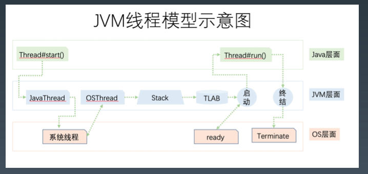
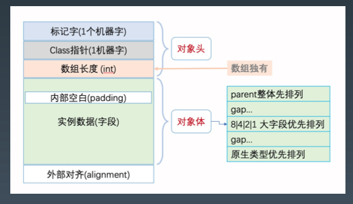
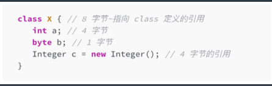
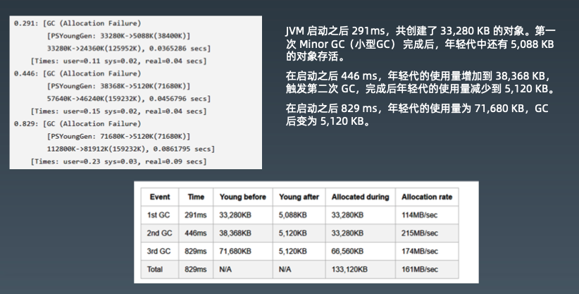
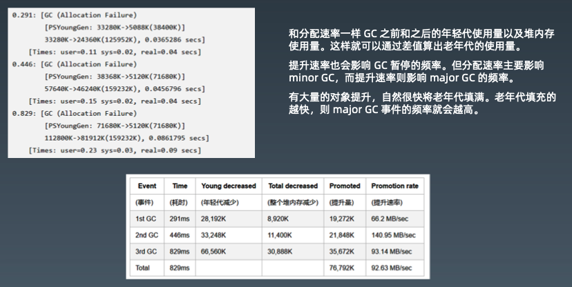
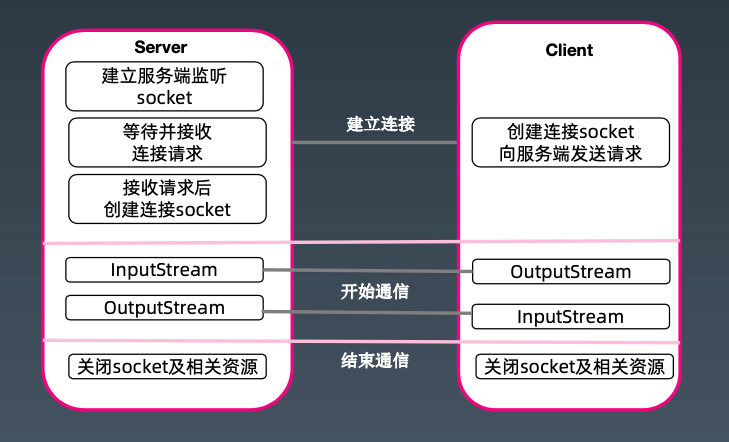
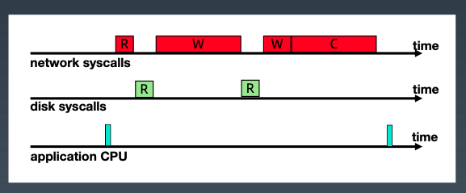
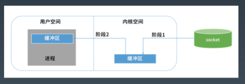
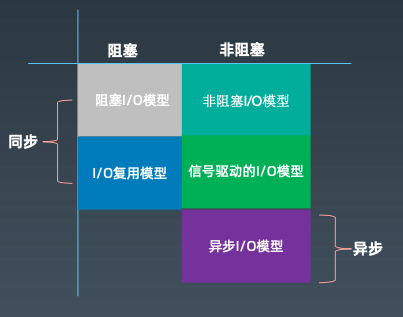

## JVM调优分析

* GC日志解读与分析

  * 下面这段代码模拟了JVM真实情况下的内存使用，不停地有对象进入年轻代中，部分成了垃圾被回收，部分晋升到老年代。当堆内存的使用率达到一个阈值时，则触发GC。

    ```java
    /**
     * 模拟JVM堆内存的使用
     */
    public class GCLogAnalysis {
        // 随机数；记得这里可以设置随机数种子；
        private static final Random random = new Random();
    
        public static void main(String[] args) {
            // 当前毫秒时间戳
            long startMillis = System.currentTimeMillis();
            // 持续运行毫秒数； 可根据需要进行修改
            long timeoutMillis = TimeUnit.SECONDS.toMillis(1);
            // 结束时间戳
            long endMillis = startMillis + timeoutMillis;
            LongAdder counter = new LongAdder();
            System.out.println("正在执行...");
            // 缓存一部分对象；进入老年代
            int cacheSize = 2000;
            Object[] cachedGarbage = new Object[cacheSize];
            // 在此时间范围内，持续循环
            while (System.currentTimeMillis() < endMillis) {
                // 生成垃圾对象
                Object garbage = generateGarbage(100 * 1024);
                counter.increment();
                int randomIndex = random.nextInt(2 * cacheSize);
                if (randomIndex < cacheSize) {
                    cachedGarbage[randomIndex] = garbage;
                }
            }
            System.out.println("执行结束！共生成对象次数：" + counter.longValue());
        }
    
        // 生成对象
        private static Object generateGarbage(int max) {
            int randomSize = random.nextInt(max);
            int type = randomSize % 4;
            Object result = null;
            switch (type) {
                case 0:
                    result = new int[randomSize];
                    break;
                case 1:
                    result = new byte[randomSize];
                    break;
                case 2:
                    result = new double[randomSize];
                    break;
                default:
                    StringBuilder builder = new StringBuilder();
                    String randomString = "randomString-Anything";
                    while (builder.length() < randomSize) {
                        builder.append(randomString);
                        builder.append(max);
                        builder.append(randomSize);
                    }
                    result = builder.toString();
                    break;
            }
    
            return result;
        }
    
    }
    ```

  * 分别使用 512m,1024m/1g, 2048m/2g, 4096m/4g 观察 GC 信息的不同，模拟一下OOM

    ```shell
    java -Xmx128m -Xloggc:gc.demo.log -XX:+PrintGCDetails -XX:+PrintGCDateStamps GCLogAnalysis
    ```

  * 分别使用不同的GC方式去运行程序，解读GC日志

    ```shell
    java -XX:+UseSerialGC -Xms512m -Xmx512m -Xloggc:gc.demo.log -XX:+PrintGCDetails -XX:+PrintGCDateStamps GCLogAnalysis
    ```

  * 工具：

    [GCEasy](https://gceasy.io/)

    GCViewer

* JVM线程堆栈分析

  * JVM线程模型

    

  * JVM 内部线程主要分为以下几种:

    * VM线程:单例的VM Thread对象，负责执行VM操作;
    * 定时任务线程:单例的 Watcher Thread 对象， 模拟在 VM 中执行定时操作的计时器中断;
    * GC线程:垃圾收集器中，用于支持并行和并发垃圾回收的线程;
    * 编译器线程:将字节码编译为本地机器代码;
    * 信号分发线程:等待进程指示的信号，并将其分配给 Java 级别的信号处理方法。

  * 工具：

    [FastThread](https://fastthread.io/)

* 内存分析与相关工具

  > 请思考一个问题:
  >
  > 一个对象具有1000个属性，与1000个对象每个具有1个属性， 哪个占用的内存空间更大?

  * 对象

    

    > 一个Java对象占用多少内存？

    可以使用 Instrumentation.getObjectSize()方法来估算一个对象占用的内存空间。

    JOL (Java Object Layout) 可以用来查看对象内存布局。

    对比结构体与 Data Object？

  * 对象头和对象引用

    * 在64位 JVM 中，对象头占据的空间是12 byte(=96bit=64+32)，但是以8字节对齐，所以一个空类的实例至少占用16字节。
    * 在32位 JVM 中，对象头占8个字节，以4的倍数对齐(32=4*8)。
    * 所以 new 出来很多简单对象，甚至是 new Object()，都会占用不少内容。
    * 通常在32位 JVM，以及内存小于 -Xmx32G 的64位 JVM 上(默认开启指针压缩)，一个引用占的内存默 认是4个字节。
    * 因此，64位 JVM 一般需要多消耗堆内存。

  * 包装类型

    * 比原生数据类型消耗的内存要多
    * **Integer**:占用16字节(头部8+4=12，数据4字节)，因为 int 部分占4个字节。 所以使用 Integer 比原生类型 int 要多消耗 300% 的内存。
    * **Long**:一般占用24个字节(头部8+4+数据8=20字节， 再对齐)，当然，对象的实际大小由底层平台的内存对 齐确定，具体由特定 CPU平台的 JVM 实现决定。 看起 来一个 Long 类型的对象，比起原生类型 long 多占用了16个字节(也多消耗200%)。

  * 多维数组

    * 在二维数组 `int[dim1][dim2]` 中，每个嵌套的 数组 `int[dim2]` 都是一个单独的 Object，会额外占用16字 节的空间。当数组维度更大时，这种开销特别明显。
    * int`[128][2]` 实例占用3600字节。 而 int`[256] `实例则只占用 1040字节。里面的有效存储空间是一样的，3600 比起 1040多了246%的额外开销。在极端情况下，byte`[256][1]`， 额外开销的比例是19倍!

  * String

    * String 对象的空间随着内部字符数组的增长而增长。 当然，String 类的对象有24个字节的额外开销。
    * 对于10字符以内的非空 String，增加的开销比起有效载荷 (每个字符2字节 + 4 个字节的 length)，多占用了100% 到 400% 的内存。

  * 对齐是绕不过去的问题

    * 

    * 我们可能会认为，一个 X 类的实例占用17字节的空间。 但是 由于需要对齐(padding)，JVM 分配的内存是8字节的整数倍， 所以占用的空间不是17字节，而是24字节。

  * 常见错误

    * OutOfMemoryErrot: Java heap space

      创建新的对象时，堆内存中的空间不足以存放新创建的对象

    * OutOfMemoryError: PermGen space/OutOfMemoryError: Metaspace

      是加载到内存中的类数量太多或 体积太大，超过了 PermGen 区的大小。

      解决办法: 增大 PermGen/Metaspace 

      -XX:MaxPermSize=512m 

      -XX:MaxMetaspaceSize=512m

    * OutOfMemoryError: Unable to create new native thread

      程序创建的线程数 量已达到上限值的异常信息。
  
      解决思路:

      1. 调整系统参数 ulimit -a，echo 120000 > /proc/sys/kernel/threads-max 
      2. 降低 xss 等参数
      3. 调整代码，改变线程创建和使用方式
  
  * 内存Dump分析工具
    * Eclipse MAT
    * jhat
    
  
* JVM分析调优经验

  1. 高分配速率（High Allocation Rate）

     * 分配速率(Allocation rate)表示单位时间内分配的内存量。通常使用 MB/sec作 为单位。上一次垃圾收集之后，与下一次GC开始之前的年轻代使用量，两者的差 值除以时间,就是分配速率。
     * 分配速率过高就会严重影响程序的性能，在 JVM 中可能会导致巨大的 GC 开销。
     * 示意：
       * 正常系统:分配速率较低 ~ 回收速率 -> 健康 
       * 内存泄漏:分配速率 持续大于 回收速率 -> OOM 
       * 性能劣化:分配速率很高 ~ 回收速率 -> 亚健康
     * 
     * 给新出生的对象分配Eden区的空间。考虑蓄水池效应。影响 Minor GC 的次数和时间，进而影响吞吐量。

  2. 过早提升（Premature Promotion）

     * 提升速率(promotion rate)用于衡量单位时间内从年轻代提升到老年代的数据量。 一般使用 MB/sec 作为单位, 和分配速率类似。
     * JVM 会将长时间存活的对象从年轻代提升到老年代。根据分代假设，可能存在一 种情况，老年代中不仅有存活时间长的对象,，也可能有存活时间短的对象。这就 是过早提升:对象存活时间还不够长的时候就被提升到了老年代。
     * major GC 不是为频繁回收而设计的，但 major GC 现在也要清理这些生命短暂 的对象，就会导致 GC 暂停时间过长。这会严重影响系统的吞吐量。

     * 
     * 一般来说过早提升的症状表现为以下形式:
       1. 短时间内频繁地执行fullGC
       2. 每次fullGC后老年代的使用率都很低，在10-20%或以下
       3. 提升速率接近于分配速率

     * 实验例子： 

       -Xmx24m -XX:NewSize=16m -XX:MaxTenuringThreshold=1

  3. 解决这类问题

     * 解决这类问题，需要让年轻代存放得下暂存的数据，有两种简单的方法。
       * 一是增加年轻代的大小，设置 JVM 启动参数，类似这样: -Xmx64m -XX:NewSize=32m，程序在执行时，Full GC 的次数自然会减少很多，只会对 minor GC 的持续时间产生影响。
       * 二是减少每次业务处理使用的内存数量，也能得到类似的结果。
       * 至于选用哪个方案，要根据业务需求决定。但总体目标依然是一致的:让临时数据能够在年轻代存放得下。

* JVM 疑难情况问题分析

  * Arthas 诊断分析工具

    1、查询业务日志，可以发现这类问题:请求压力大，波峰，遭遇降级，熔断等等， 基础服务、外部 API 依赖出现故障。

    2、查看系统资源和监控信息:

    * 硬件信息、操作系统平台、系统架构;

    * 排查 CPU 负载、内存不足，磁盘使用量、硬件故障、磁盘分区用满、IO 等待、IO 密集、丢数据、并发竞争等 情况;

    * 排查网络:流量打满，响应超时，无响应，DNS 问题，网络抖动，防火墙问题，物理故障，网络参数调整、超 时、连接数。

    3、查看性能指标，包括实时监控、历史数据。可以发现假死，卡顿、响应变慢等现象;

    * 排查数据库， 并发连接数、慢查询、索引、磁盘空间使用量、内存使用量、网络带宽、死锁、TPS、查询数据量、redo 日志、undo、 binlog 日志、代理、工具 BUG。
    * 可以考虑的优化包括: 集群、主备、只读实例、分 片、分区; 
    * 可能还需要关注系统中使用的各类中间件。

    4、排查系统日志， 比如重启、崩溃、Kill 。

    5、APM，比如发现有些链路请求变慢等等。

    6、排查应用系统

    * 排查配置文件: 启动参数配置、Spring 配置、JVM 监控参数、数据库参数、Log 参数、内存问题，比如是否存 在内存泄漏，内存溢出、批处理导致的内存放大等等;

    * GC 问题， 确定 GC 算法，GC 总耗时、GC 最大暂停时间、分析 GC 日志和监控指标: 内存分配速度，分代提 升速度，内存使用率等数据，适当时修改内存配置;

    * 排查线程, 理解线程状态、并发线程数，线程 Dump，锁资源、锁等待，死锁;
    * 排查代码， 比如安全漏洞、低效代码、算法优化、存储优化、架构调整、重构、解决业务代码 BUG、第三方库、XSS、CORS、正则; 
    7、可以在性能测试中进行长期的压测和调优分析。


## Java Socket 编程

* 服务器通信原理

  * 

* 实现简易的HTTP服务器

  * 创建一个ServerSocket，绑定端口，当有客户端请求时通过accept方法拿Socket，进而进行处理，模拟输出HTTP响应报文。运行程序时，配置同样大小堆内存，同时使用压测工具`wrk`进行压测。

    1. 版本一 —— 单线程来处理请求

       ```java
       // 单线程的socket程序
       public class HttpServer01 {
           public static void main(String[] args) throws IOException {
               ServerSocket serverSocket = new ServerSocket(8801);
               while (true) {
                   try {
                       Socket socket = serverSocket.accept();
                       service(socket);
                   } catch (IOException e) {
                       e.printStackTrace();
                   }
               }
           }
       
           private static void service(Socket socket) {
               try {
                   PrintWriter printWriter = new PrintWriter(socket.getOutputStream(), true);
                   printWriter.println("HTTP/1.1 200 OK");
                   printWriter.println("Content-Type:text/html;charset=utf-8");
                   String body = "hello,nio1";
                   printWriter.println("Content-Length:" + body.getBytes().length);
                   printWriter.println();
                   printWriter.write(body);
                   printWriter.close();
                   socket.close();
               } catch (IOException e) {
                   e.printStackTrace();
               }
           }
       }
       ```

    2. 版本二 —— 每个请求一个线程

       ```java
       // 每个请求一个线程
       public class HttpServer02 {
           public static void main(String[] args) throws IOException {
               ServerSocket serverSocket = new ServerSocket(8802);
               while (true) {
                   try {
                       final Socket socket = serverSocket.accept();
                       new Thread(() -> {
                           service(socket);
                       }).start();
                   } catch (IOException e) {
                       e.printStackTrace();
                   }
               }
           }
           private static void service(Socket socket) {
               try {
                   PrintWriter printWriter = new PrintWriter(socket.getOutputStream(), true);
                   printWriter.println("HTTP/1.1 200 OK");
                   printWriter.println("Content-Type:text/html;charset=utf-8");
                   String body = "hello,nio2";
                   printWriter.println("Content-Length:" + body.getBytes().length);
                   printWriter.println();
                   printWriter.write(body);
                   printWriter.close();
                   socket.close();
               } catch (Exception e) {
                   e.printStackTrace();
               }
           }
       }
       ```

    3. 版本三 —— 线程池

       ```java
       // 创建了一个固定大小的线程池处理请求
       public class HttpServer03 {
           public static void main(String[] args) throws IOException {
               ExecutorService executorService = Executors.newFixedThreadPool(
                       Runtime.getRuntime().availableProcessors() * 4);
               System.out.println(Runtime.getRuntime().availableProcessors());
               final ServerSocket serverSocket = new ServerSocket(8803);
               while (true) {
                   try {
                       final Socket socket = serverSocket.accept();
                       executorService.execute(() -> service(socket));
                   } catch (IOException e) {
                       e.printStackTrace();
                   }
               }
           }
       
           private static void service(Socket socket) {
               try {
                   PrintWriter printWriter = new PrintWriter(socket.getOutputStream(), true);
                   printWriter.println("HTTP/1.1 200 OK");
                   printWriter.println("Content-Type:text/html;charset=utf-8");
                   String body = "hello,nio3";
                   printWriter.println("Content-Length:" + body.getBytes().length);
                   printWriter.println();
                   printWriter.write(body);
                   printWriter.close();
                   socket.close();
               } catch (Exception e) {
                   e.printStackTrace();
               }
           }
       
       }
       ```

  * 使用压测工具压测后，一般来讲我们会观察到

    * 服务器每秒处理请求量：版本三 > 版本二 > 版本一
    * 每个请求收到响应的延迟时间：版本一 > 版本二 > 版本三

    也就是说使用线程池处理请求的表现最好，多线程次之，单线程最差。在实验中你不一定能观察到同样的现象，可能需要调整一些参数，比方说增大压测的连接数，延长压测的时间等。

    ```shell
    wrk -c 40 -d30s http://localhost:port
    ```

* 分析上述实验，探讨IO通信

  * 分析一下上述的实验

    在服务器端线程接收客户端请求，到处理请求，返回响应的过程中，存在两种类型的操作：

    - CPU 计算/业务处理
    - IO 操作与等待/网络、磁盘、数据库

  * 举例 - 通过网络访问，服务器端读取本地文件，再返回给客户端(如下图)

    

    * 这种情况下，大部分 CPU 等资源，就被浪费了。

    * 不仅面临线程/CPU的问题，还要面对数据来回复制的问题，数据会从操作系统的用户空间和内核空间来回复制。

      

  * IO的背景知识

    * 阻塞与非阻塞

      阻塞：线程持续等待资源中数据准备完成，直到返回响应结果。

      非阻塞：线程直接返回结果，不会持续等待资源准备数据结束后才响应结果。

    * 同步与异步

      同步与异步是指访问数据的机制，同步一般指主动请求并等待IO操作完成的方式。

      异步则指主动请求数据后便可以继续处理其它任务，随后等待IO操作完毕的通知。

    * 区别？联系？

      - 同步、异步是通信模式

      - 阻塞、非阻塞是线程处理模式

    * 例子：老王烧开水

      1. 普通水壶烧开水，站在旁边，主动的看水开了没有？同步阻塞
      2. 普通水壶烧开水，去干点别的事，每过一段时间去看看水开了没有，水没开就走人。 同步非阻塞
      3. 响水壶烧开水，等着水烧开，但不会每过一段时间主动看水开了没有。如果水开了，水壶自动通知他。 异步阻塞
      4. 响水壶烧开水，去干点别的事，如果水开了，水壶自动通知他。异步非阻塞

    * 传统BIO模型

      传统BIO是一种同步的阻塞IO，IO在进行读写时，该线程将被阻塞，线程无法进行其它操作。

    * 伪异步IO模型

      以传统BIO模型为基础，通过线程池的方式维护所有的IO线程，实现相对高效的线程开销及管理。

    * NIO模型 (Non-Blocking IO)

      NIO模型是一种同步非阻塞IO，主要有三大核心部分：Channel(通道)，Buffer(缓冲区), Selector(多路复用器)。传统IO基于字节流和字符流进行操作，而NIO基于Channel和Buffer(缓冲区)进行操作，数据总是从通道读取到缓冲区中，或者从缓冲区写入到通道中。Selector(多路复用器)用于监听多个通道的事件(比如：连接打开，数据到达)。因此，单个线程可以监听多个数据通道。

  * 五种IO模型

    

  * 

    

* Netty框架简介


