## Netty原理与API网关

### 1. 谈谈什么是高性能

* 谈谈什么是高性能 - API网关

  - 高并发用户（Concurrent Users）

    wrk 中的`-c`参数，connection的数量

  - 高吞吐量（Throughout）

    每秒处理的请求量Requests/second，或者每秒处理事务量 

  - 低延迟（Latency）

    延迟分布图 - （高斯分布）

  - ～容量

* 高性能的另一面

  - 系统复杂度x10以上
  - 建设与维护成本
  - 故障或BUG导致的破坏性x10以上

* 应对策略

  稳定性建设（混沌工程）：

  - 容量
  - 爆炸半径
  - 工程方面积累与改进

* 总之，高性能是相对的。不是所有的系统都应该盲目追求高性能，这取决于业务的需求，一般来讲最适合自己的才是最好的。

* AA

### 2. Netty原理

* Netty如何实现高性能？
* Netty 网络程序优化？

### 3. 典型应用：API网关 

* 此处的API网关与我们在网络工程中了解到的局域网的Gateway不是一个概念，此处的API网关是个抽象概念，是指API层面的关卡。

  * API网关的四大职能

    

    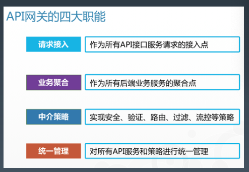

* 网关的分类

  

  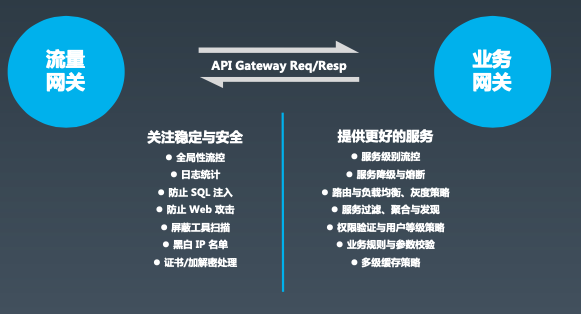

* 典型的网关

  

  


### 4. 自己动手实现API网关

* 最简单的网关--gateway 1.0

  

  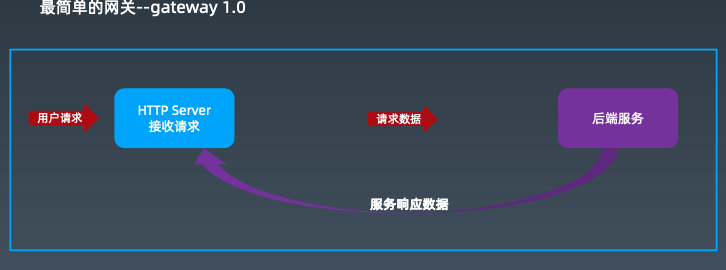

* 最简单的网关--gateway 2.0

  

  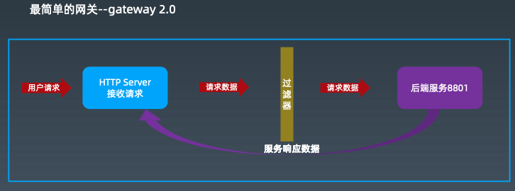

* 最简单的网关--gateway 3.0

  

  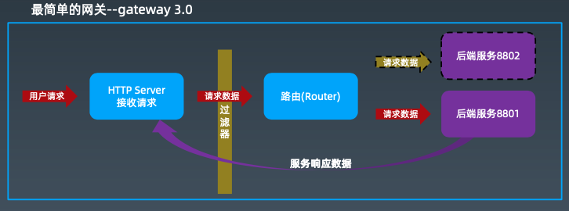

* 实战

  [实战演练](https://github.com/KingQino/Geek/tree/main/Submission/week3)

## 多线程


### 1. 多线程基础

* 背景：摩尔定律失效 -> 多核 + 分布式时代的来临

* 多 CPU 核心意味着同时操作系统有更多的 并行计算资源可以使用。

  线程越多，管理复杂度越高。

* Java线程的创建过程

  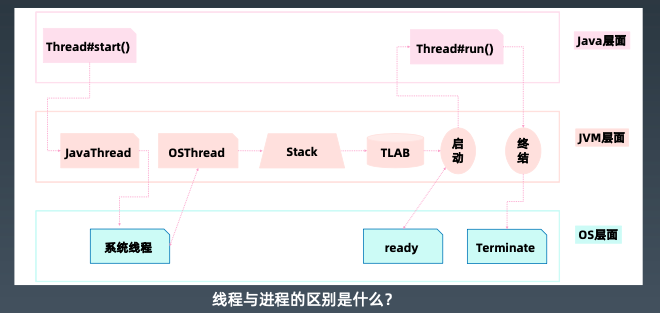


### 2.Java多线程

* 引入

  ```java
  public static void main(String[] args) throws InterruptedException {
      Runnable task = () -> {
          try {
                  Thread.sleep(5000);
          } catch (InterruptedException e) {
              e.printStackTrace();
          }
              Thread t = Thread.currentThread();
              System.out.println("当前线程:" + t.getName());
      };
      Thread thread = new Thread(task);
      thread.setName("test-thread-1");
      thread.setDaemon(true);
      thread.start();
  
      //Thread.sleep(5500);
  }
  ```

  * 对于一个JVM的进程来说，如果当前运行的线程都是守护线程，那么JVM会把当前进程直接停止掉。

* 基础接口 - Runnable

  * 查看Runnable接口的定义。一个抽象方法run

  * Thread本身实现了Runnable

  * __注意__

    Thread#start():创建新线程

    Thead#run(): 本线程调用

  * 两种用法

    ```java
    // 示例1
    Runnable task = new Runnable() {
      @Override
      public void run() {
        System.out.println("业务逻辑..."); 
      }
    }
    ```

    ```java
    // 示例2
    public class XXXTask implements Runnable {
    	@Override
    	public void run() {
    		System.out.println("执行逻辑..."); 
      }
    }
    ```

* 线程状态

  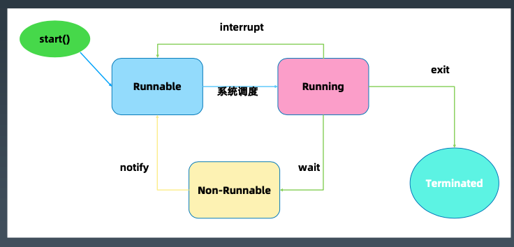

  https://docs.oracle.com/javase/jp/8/docs/api/java/lang/Thread.State.html

* Thread类

  | 重要属性**/**方法                              | 说明                                 |
  | ---------------------------------------------- | ------------------------------------ |
  | **volatile** String **name**;                  | 线程名称 – 诊断分析使用              |
  | **boolean** **daemon** = **false**;            | 后台守护线程标志 – 决定JVM优雅关闭   |
  | Runnable **target**;                           | 任务(只能通过构造函数传入)           |
  | **synchronized void** start()                  | 【协作】启动新线程并自动执行         |
  | **void** join()                                | 【协作】等待某个线程执行完毕(来汇合) |
  | **static native** Thread currentThread();      | 静态方法: 获取当前线程信息           |
  | **static native void** sleep(**long** millis); | 静态方法: 线程睡眠并让出CPU时间片    |

* wait & notify （这是所有`Object`对象的方式，sleep是Thread类的方法）

  | Object#方法                                    | 说明                                                         |
  | ---------------------------------------------- | ------------------------------------------------------------ |
  | **void** wait()                                | 放弃锁+等待0ms+尝试获取锁;                                   |
  | **void** wait(**long** timeout, **int** nanos) | 放弃锁 + wait + 到时间自动唤醒/中途唤醒 (精度: nanos>0则 timeout++) |
  | **native void** wait(**long** timeout);        | 放弃锁+ wait + 到时间自动唤醒/中途被唤醒 (唤醒之后需要自动获取锁) |
  | **native void** notify();                      | 发送信号通知1个等待线程                                      |
  | **native void** notifyAll();                   | 发送信号通知所有等待线程                                     |

  辨析：

  * Thread.sleep:释放CPU

  * Object#wait : 释放对象锁

* Thread的状态改变操作

  1. Thread.sleep(long millis)，一定是当前线程调用此方法，当前线程进入 TIMED_WAITING 状态，但不释放对象锁，millis 后线程自动苏醒进入就绪状态。作用:给其它线程执行机会的最佳方式。
  2. Thread.yield()，一定是当前线程调用此方法，当前线程放弃获取的 CPU 时间片，但不释放锁资源，由运行状态变为就绪状态，让 OS 再次选择线程。作用:让相同优先级的线程轮流执行，但并不保证一定会轮流执行。实际中无法保证 yield() 达到让步目的，因为让步的线程还有可能被线程调度程序再次选中。Thread.yield() 不会导致阻塞。该方法与 sleep() 类似，只是不能由用户指定暂停多长时间。
  3. t.join()/t.join(long millis)，当前线程里调用其它线程 t 的 join 方法，当前线程进入WAITING/TIMED_WAITING 状态， 当前线程不会释放已经持有的对象锁，但是join()方法内部调用了 t.wait，所以会释放t这个对象上的同步锁。线程 t 执行完毕或者 millis 时间到，当前线程进入就绪状态。其中，wait 操作对应的 notify 是由 jvm 底层的线程执行结束前触发的。
  4. obj.wait()，当前线程调用对象的 wait() 方法，当前线程释放 obj 对象锁，进入等待队列。依靠 notify()/notifyAll() 唤醒或者 wait(long timeout) timeout 时间到自动唤醒。唤醒会，线程恢复到 wait 时的状态。
  5. obj.notify() 唤醒在此对象监视器上等待的单个线程，选择是任意性的。notifyAll() 唤醒在此对象监视器上等待的所有 线程。

* Thread的中断与异常处理

  1. 线程内部自己处理异常，不溢出到外层(Future 可以封装)。
  2. 如果线程被 Object.wait, Thread.join和Thread.sleep 三种方法之一阻塞，此时调用该线程的interrupt() 方法，那么该线程将抛出一个 InterruptedException 中断异常(该线程必须事先预备好处理此异常)，从 而提早地终结被阻塞状态。如果线程没有被阻塞，这时调用 interrupt() 将不起作用，直到执行到 wait/sleep/join 时，才马上会抛出InterruptedException。
  3. 如果是计算密集型的操作怎么办?

* Thread状态

  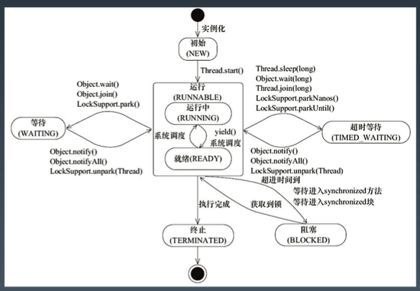


### 3.线程安全

* 背景：多个线程竞争同一资源时，如果对资源的访问顺序敏感，就称存在竞态条件。导致竞态条件发生的代码区称作临界区。不进行恰当的控制，会导致线程安全问题。

  _

  

  

* 并发相关的性质

  * 原子性：原子操作，注意跟事务ACID里原子性的区别与联系。对基本数据类型的变量的读取和赋值操作是原子性操作，即这些操作是不可被中断的，要么执行，要么不执行。

    例子（只有语句1是原子操作）：

    ```java
    x = 10; // 语句1
    
    y = x; // 语句2
    
    x++; // 语句3
    
    x = x + 1; // 语句4
    ```

  * 可见性：对于可见性，Java提供了volatile关键字来保证可见性。当一个共享变量被volatile修饰时，它会保证修改的值会立即被更新到主存，当有其他线程需要读取时，它会去内存中读取新值。

    另外，通过 synchronized 和 Lock 也能够保证可见性，synchronized 和 Lock 能保证同一时刻 只有一个线程获取锁然后执行同步代码，并且在释放锁之前会将对变量的修改刷新到主存当中。

    注意：__volatile 并不能保证原子性。__

  * 有序性: Java 允许编译器和处理器对指令进行重排序，但是重排序过程不会影响到单线程程序的执行，却会影 响到多线程并发执行的正确性。可以通过 volatile 关键字来保证一定的“有序性”(synchronized 和 Lock 也可以)。

    happens-before 原则(先行发生原则):

    1. 程序次序规则:一个线程内，按照代码先后顺序
    2.  锁定规则:一个 unLock 操作先行发生于后面对同一个锁的 lock 操作
    3. Volatile 变量规则:对一个变量的写操作先行发生于后面对这个变量的读操作
    4. 传递规则:如果操作 A 先行发生于操作 B，而操作 B 又先行发生于操作 C，则可以得出 A 先于 C
    5. 线程启动规则:Thread 对象的 start() 方法先行发生于此线程的每个一个动作
    6. 线程中断规则:对线程 interrupt() 方法的调用先行发生于被中断线程的代码检测到中断事件的发生
    7. 线程终结规则:线程中所有的操作都先行发生于线程的终止检测，我们可以通过 Thread.join() 方法结束、 Thread.isAlive() 的返回值手段检测到线程已经终止执行
    8. 对象终结规则:一个对象的初始化完成先行发生于他的 finalize() 方法的开始

    

  * 实战：运行，尝试理解原因。

    [多线程实战](https://github.com/JavaCourse00/JavaCourseCodes/tree/main/03concurrency/0301/src/main/java/java0)

  * Synchronised的实现

    _ 

    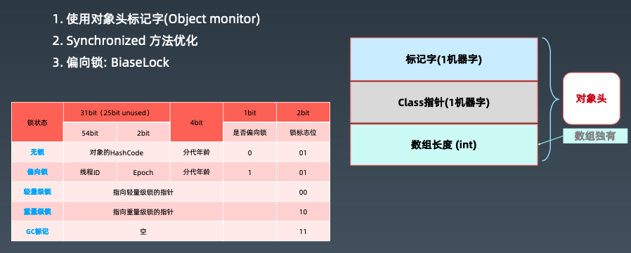

  * volatile

    1. 每次读取都强制从主内存刷数据

    2. 适用场景: 单个线程写;多个线程读

    3. 原则: 能不用就不用，不确定的时候也不用 

    4. 替代方案: Atomic 原子操作类

  * final

    | final定义类型     | 说明                                                         |
    | ----------------- | ------------------------------------------------------------ |
    | final class XXX   | 不允许继承                                                   |
    | final 方法        | 不允许 Override                                              |
    | final 局部变量    | 不允许修改                                                   |
    | final 实例属性    | • 构造函数/初始化块之后不允许变更;  • 只能赋值一次  • 安全发布: 构造函数结束返回时，final 域最新的值被保证对其他线程可见 |
    | final static 属性 | 静态块执行后不允许变更; 只能赋值一次                         |

    思考: final 声明的引用类型与原生类型在处理时有什么区别? Java 里的常量替换。写代码最大化用 final 是个好习惯。


### 4. 线程池原理与应用

* 为什么我们需要线程池？不能不断地申请线程，用完即销毁吗？

  首先，我们可以不断地申请线程去处理任务再销毁，但是需要我们自己管理，而且系统资源是有限的，如何限制线程消耗过多的系统资源，也是一个挑战。

* 线程池

  1. Excutor: 执行者，顶层接口
  2. ExcutorService: 接口API
  3. ThreadFactory：线程工厂
  4. ThreadPoolExecutor
  5. Excutors: 工具类，创建线程

* Excutor - 执行者

  | 重要方法                        | 说明             |
  | ------------------------------- | ---------------- |
  | void execute(Runnable command); | 执行可运行的任务 |

  -

  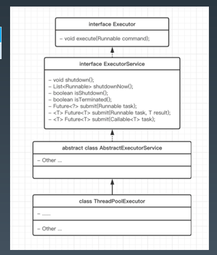

  - 线程池从功能上看，就是一个任务执行器

  - submit 方法 -> 有返回值，用 Future 封装;   

    execute 方法 -> 无返回值

  - submit 方法的异常可以在主线程中 get 捕获到 

    execute 方法执行任务是捕捉不到异常的

* ExecutorService

  | 重要方法                                       | 说明                                   |
  | ---------------------------------------------- | -------------------------------------- |
  | void execute(Runnable command);                | 执行可运行的任务                       |
  | void shutdown();                               | 关闭线程池                             |
  | List<Runnable> shutdownNow();                  | 立即关闭                               |
  | Future<?> submit(Runnable task);               | 提交任务; 允许获取执行结果             |
  | <T> Future<T> submit(Runnable task, T result); | 提交任务(指定结果); 控制或获取执行结果 |
  | <T> Future<T> submit(Callable<T> task);        | 提交任务; 允许控制任务和获取执行结果   |

  * shutdown():停止接收新任务，原来的任务继续执行

    shutdownNow():停止接收新任务，原来的任务停止执行

  * 优雅停机 - 对用户友好

    boolean awaitTermination(timeOut, unit):阻塞当前线程，返回是否线程都执行完

    先调用shutdown，然后awaitTermination阻塞住主线程一段时间，一段时间后根据awaitTermination方法的返回值决定是否再调用shutdownnow

* ThreadPoolExecutor

  ThreadPoolExecutor提交任务逻辑：

  1. 判断corePoolSize（创建）

  2. 加入workQueue

  3. 判断maximumPoolSize（创建）

  4. 执行拒绝策略处理器

     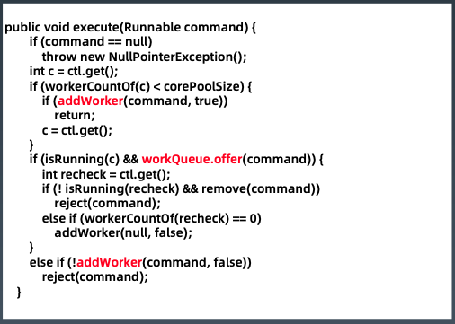

  线程池参数

  * 缓冲队列

    BlockingQueue 是双缓冲队列。BlockingQueue 允许两个线程同时向队列一个存储，一个取出操作。在保证并发安全的同时，提高了队列的存取效率。

    1.  ArrayBlockingQueue:规定大小的 BlockingQueue，其构造必须指定大小。其所含的对象 是 FIFO 顺序排序的。
    2. LinkedBlockingQueue:大小不固定的 BlockingQueue，若其构造时指定大小，生成的 BlockingQueue 有大小限制，不指定大小，其大小有 Integer.MAX_VALUE 来决定。其所含 的对象是 FIFO 顺序排序的。
    3. PriorityBlockingQueue:类似于 LinkedBlockingQueue，但是其所含对象的排序不是 FIFO， 而是依据对象的自然顺序或者构造函数的 Comparator 决定。
    4. SynchronizedQueue:特殊的 BlockingQueue，对其的操作必须是放和取交替完成。

  * 拒绝策略

    1. ThreadPoolExecutor.AbortPolicy: 丢弃任务并抛出 RejectedExecutionException异常
    2. ThreadPoolExecutor.DiscardPolicy:丢弃任务，但是不抛出异常
    3. ThreadPoolExecutor.DiscardOldestPolicy:丢弃队列最前面的任务，然后重新提交被拒绝 的任务
    4. ThreadPoolExecutor.CallerRunsPolicy:由调用线程(提交任务的线程)处理该任务

  * ThreadFactory示例

    ```java
    public class CustomThreadFactory implements ThreadFactory {
        private AtomicInteger serial = new AtomicInteger(0);
    
        @Override
        public Thread newThread(Runnable r) {
            Thread thread = new Thread(r);
            thread.setDaemon(true); // 根据需要，设置守护线程
            thread.setName("CustomThread-" + serial.getAndIncrement());
            return thread;
        }
    }
    ```

  * ThreadPoolExecutor

    | 重要属性/方法                      | 说明           |
    | ---------------------------------- | -------------- |
    | int corePoolSize;                  | 核心线程数     |
    | int maximumPoolSize;               | 最大线程数     |
    | ThreadFactory threadFactory;       | 线程创建工厂   |
    | BlockingQueue<Runnable> workQueue; | 工作队列       |
    | RejectedExecutionHandler handler;  | 拒绝策略处理器 |
    | void execute(Runnable command)     | 执行           |
    | Future<?> submit(Runnable task)    | 提交任务       |
    | submit(Runnable task, T result)    | 提交任务       |
    | submit(Callable<T> task)           | 提交任务       |

    ThreadPoolExecutor 示例

    ```java
    public static ThreadPoolExecutor initThreadPoolExecutor() {
      int coreSize = Runtime.getRuntime().availableProcessors();
      int maxSize = Runtime.getRuntime().availableProcessors() * 2;
      BlockingQueue<Runnable> workQueue = new LinkedBlockingDeque<>(500);
      CustomThreadFactory customThreadFactory = new CustomThreadFactory();
    
      return new ThreadPoolExecutor(coreSize, maxSize, 1, TimeUnit.MINUTES, workQueue, customThreadFactory);
    }
    ```

    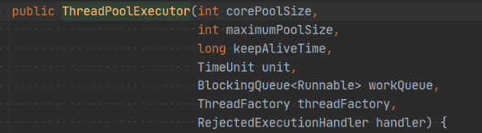

  * 创建线程池方法

    除了上述例子中新建线程池的方法外，还有一些更简便的方法

    1. newSingleThreadExecutor

       创建一个单线程的线程池。这个线程池只有一个线程在工作，也就是相当于单线程串行执行所有任务。如果这个唯一的线程因为异常结束，那么会有一个新的线程来替代它。此线程池保证所有任务的执行顺序按照任务的提交顺序执行。

    2. newFixedThreadPool

       创建固定大小的线程池。每次提交一个任务就创建一个线程，直到线程达到线程池的最大大小。线程池的大小一旦达到最大值就会保持不变，如果某个线程因为执行异常而结束，那么线程池会补充一个新线程。

    3. newCachedThreadPool

       创建一个可缓存的线程池。如果线程池的大小超过了处理任务所需要的线程， 那么就会回收部分空闲(60秒不执行任务)的线程，当任务数增加时，此线程池又可以智能的添加新线程来处理任务。

       此线程池不会对线程池大小做限制，线程池大小完全依赖于操作系统(或者说JVM)能够创建的最大线程大小。

    4. newScheduledThreadPool

       创建一个大小无限的线程池，此线程池支持定时以及周期性执行任务的需求。

  * 创建固定线程池的经验

    不是越大越好，太小肯定也不好

    假设核心数为 N

    1. 如果是__CPU密集型__应用，则线程池大小设置为 N 或 N+1
    2. 如果是__IO密集型__应用，则线程池大小设置为 2N 或 2N+2

  * Callable - 基础接口

    | 重要方法                   | 说明     |
    | -------------------------- | -------- |
    | V call() throws Exception; | 调用执行 |

    ```java
    public class RandomSleepTask implements Callable<Integer> {
      @Override
      public Integer call() throws Exception {
        Integer sleep = new Random().nextInt(10000);
        TimeUnit.MILLISECONDS.sleep(sleep);
        return sleep;
      }
    }
    ```

    对比：

    *  Runnable#run()没有返回值
    * Callable#call()方法有返回值

  * Future - 基础接口

    | 重要方法                                                     | 说明                      |
    | ------------------------------------------------------------ | ------------------------- |
    | boolean cancel(boolean mayInterruptIfRunning);               | 取消任务 (执行时是否打断) |
    | boolean isCancelled();                                       | 是否被取消                |
    | boolean isDone();                                            | 是否执行完毕              |
    | V get() throws InterruptedException, ExecutionException;     | 获取执行结果              |
    | V get(**long** timeout, TimeUnit unit) **throws** InterruptedException, ExecutionException, TimeoutException; | 限时获取执行结果          |

    ```java
    public static void main(String[] args) throws Exception {
        Callable<Integer> task = new RandomSleepTask();
        ExecutorService executorService = initThreadPoolExecutor();
        Future<Integer> future1 = executorService.submit(task);
        Future<Integer> future2 = executorService.submit(task);
        //等待执行结果
        Integer result1 = future1.get(1, TimeUnit.SECONDS);
        Integer result2 = future2.get(1, TimeUnit.SECONDS);
        System.out.println("result1=" + result1);
        System.out.println("result2=" + result2);
    }
    ```


