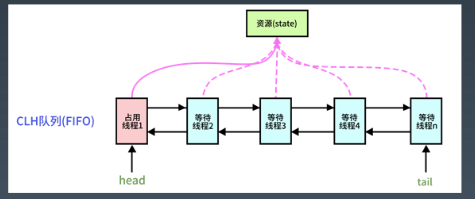

## Java并发编程

### 1. Java并发包（JUC)

* JDK核心库的包

  * java程序运行时，依赖最核心的包为`rt.jar`，runtime

    _

    

* java.util.concurrency

  _

  

  * 锁机制类 Locks : Lock, Condition, ReentrantLock, ReadWriteLock,LockSupport
  * 原子操作类 Atomic : AtomicInteger, AtomicLong, LongAdder
  * 线程池相关类 Executor : Future, Callable, Executor, ExecutorService
  * 信号量三组工具类 Tools : CountDownLatch, CyclicBarrier, Semaphore
  * 并发集合类 Collections : CopyOnWriteArrayList, ConcurrentMap

### 2. 到底什么是锁

* 为什么需要显式的 **Lock**? 

* synchronized 可以加锁，wait/notify 可以看做加锁和解锁。__那为什么还需要一个显式样的锁呢__？

  synchronized 方式的问题:

  1. 同步块的阻塞无法中断(不能 Interruptibly)
  2. 同步块的阻塞无法控制超时(无法自动解锁)
  3. 同步块无法异步处理锁(即不能立即知道是否可以拿到锁)
  4. 同步块无法根据条件灵活的加锁解锁（即只能跟同步块范围一致）

* 更自由的锁：Lock

  1. 使用方式灵活可控
  2. 性能开销小
  3. 锁工具包：java.util.concurrent.locks

  思考: Lock 的性能比 synchronized 高吗?

  Lock 接口设计:

  1. 支持中断的 API

     void lockInterruptibly() throws InterruptedException;

  2. 支持超时的 API

     boolean tryLock(long time, TimeUnit unit) throws InterruptedException;

  3. 支持非阻塞获取锁的 API

     boolean tryLock();

* 基础接口 __Lock__

  | 重要方法                                                     | 说明                                                         |
  | ------------------------------------------------------------ | ------------------------------------------------------------ |
  | **void** lock();                                             | 获取锁; 类比 **synchronized** (**lock**)                     |
  | **void** lockInterruptibly() **throws** InterruptedException; | 获取锁; 允许打断;                                            |
  | **boolean** tryLock(long time, TimeUnit unit) **throws** InterruptedException; | 尝试获取锁; 成功则返回 **true**; 超时则退出                  |
  | **boolean** tryLock();                                       | 尝试【无等待】获取锁; 成功则返回 **true**                    |
  | **void** unlock();                                           | 解锁;要求当前线程已获得锁; 类比同步块结束                    |
  | **Condition** newCondition();                                | 新增一个绑定到当前Lock的条件;<br/> 示例: (类比: **Object** monitor)<br/> **final** Lock lock = **new** ReentrantLock();<br/> **final** Condition notFull = lock.newCondition(); **final** Condition notEmpty = lock.newCondition(); |

  示例：

  ```java
  public class LockCounter {
    private int sum = 0;
    // 可重入锁+公平锁
    private Lock lock = new ReentrantLock(true);
    public int addAndGet() {
      try {
        lock.lock();
        return ++sum;
      } finally {
        lock.unlock();
      }
    }
    
    public int getSum() {
      return sum;
    }
  }
  
  public static void testLockCounter() {
    int loopNum = 100_0000;
    LockCounter counter = new LockCounter();
    IntStream.range(0, loopNum).parallel().forEach(i -> counter.incrAndGer());}
  }
  ```

  思考：

  什么是__可重入锁__？

  -- 第二次进入时是否阻塞

  什么是__公平锁__？

  -- 公平锁意味着排队靠前的优先。

  -- 非公平锁则是都是同样机会。

* 读写锁 - 接口与实现

  | 重要方法          | 说明                           |
  | ----------------- | ------------------------------ |
  | Lock readLock();  | 获取读锁；共享锁               |
  | Lock writeLock(); | 获取写锁；独占锁（也排斥读锁） |

  ```java
  public class ReadWriteLockCounter {
    private int sum = 0;
    // 可重入-读写锁-公平锁
    private ReadWriteLock lock = new ReentrantReadWriteLock(true);
    public int incrAndGet() {
      try {
        lock.writeLock().lock(); // 写锁；独占锁；被读锁排斥
        return ++sum;
      } finally {
        lock.writeLock().unlock();
      }
    }
    
    public int getSum() {
      try {
        lock.readLock().lock(); // 读锁；共享锁；保证可见性
        return ++sum;
      } finally {
        lock.readLock().unlock();
      }
    }
  }
  ```

  ```java
  // 构造方法
  public ReentrantReadWriteLock(boolean fair) {
      sync = fair ? new FairSync() : new NonfairSync();
      readerLock = new ReadLock(this);
      writerLock = new WriteLock(this);
  }
  ```

  注意: ReadWriteLock 管理一组锁，一个读锁，一个写锁。 读锁可以在没有写锁的时候被多个线程同时持有，写锁是独占的。 所有读写锁的实现必须确保写操作对读操作的内存影响。每次只能有一个写线程，但是同时可以有多个线程并发地读数据。ReadWriteLock 适用于读多写少的并发情况。

* 基础接口 - Condition

  | 重要方法                                                     | 说明                                                |
  | ------------------------------------------------------------ | --------------------------------------------------- |
  | **void** await() **throws** InterruptedException;            | 等待信号; 类比 Object#wait()                        |
  | **void** awaitUninterruptibly();                             | 等待信号;                                           |
  | **boolean** await(**long** time, TimeUnit unit) **throws** InterruptedException; | 等待信号; 超时则返回 **false**                      |
  | **boolean** awaitUntil(Date deadline) **throws** InterruptedException; | 等待信号; 超时则返回 **false**                      |
  | **void** signal();                                           | 给一个等待线程发送唤醒信号; 类比 Object#notify ()   |
  | **void** signalAll();                                        | 给所有等待线程发送唤醒信号; 类比 Object#notifyAll() |

  通过 Lock.newCondition() 创建。
  可以看做是 Lock 对象上的信号。类似于 wait/notify。

* LockSupport -- 锁当前线程

  _

  

  LockSupport 类似于 Thread类的静态方法，专门处理（执行这个代码的）本线程的。

  思考：为什么unpark需要加一个线程作为参数?

  因为一个park的线程，无法自己唤醒自己，所以需要其他线程来唤醒。

* 用锁的最佳实践

  Doug Lea在《Java并发编程：设计原则与模式》一书中，推荐的三个用锁的最佳实践，它们分别是：

  1. 永远只在更新对象的成员变量时加锁
  2. 永远只在访问可变的成员变量时加锁
  3. 永远不在调用其他对象的方法时加锁

  KimmKing总结 - 最小使用锁：

  1. 降低锁范围：锁定代码的范围/作用域
  2. 细分锁粒度：将一个大锁，拆分成多个小锁

### 3. 并发原子类

* Atomic工具类

  1. 原子类工具包

     __java.util.concurrent.atomic__

     ```java
     // 使用示例
     public class AtomicCounter {
     private AtomicInteger sum = new AtomicInteger(0); public int incrAndGet() {
     } returnsum.incrementAndGet();
     public int getSum() {
     return sum.get(); }
     }
     ```

     

  2. 无锁技术的底层实现原理

  * Unsafe API - CompareAndSwap
  * CPU 硬件指令支持 - CAS 指令
  * Value 的可见性 - volatile 关键字

  核心实现原理：

  1. volatile保证读写操作都可见（注意不保证原子）
  2. 使用CAS指令，作为乐观锁实现，通过自旋重试保证写入

  1. 思考一下，到底是有锁好，还是无锁好？

     什么情况下有锁好？什么情况下无锁好？

     CAS本质上没有使用锁。

     并发压力跟锁性能的关系：

     1. 压力非常小，性能本身要求就不高；
     2. 压力一般的情况下，无锁更快，大部分都一次写入；
     3. 压力非常大时，自旋导致重试过多，资源消耗很大。

     乐观锁、悲观锁、数据库事务锁

* **LongAdder** 对 **AtomicLong** 的改进

  通过__分段思想__改进原子类，大家想想还有哪些是用这个思想？
  多路归并的思想：

  - 快排
  - G1 GC
  - ConcurrentHashMap

  LongAdder的改进思想：

  1. AtomicInteger 和 AtomicLong 里的 value 是所有 线程竞争读写的热点数据;
  2. 将单个 value 拆分成跟线程一样多的数组 Cell[];
  3. 每个线程写自己的 Cell[i]++，最后对数组求和。

### 4. 并发工具类

* 思考一下： 多个线程之间怎么互相协作？

  前面讲到的：

  1. wait/notify
  2. Lock/Condition

  可以作为简单的协作机制。

  

  但是更复杂的应用场景，比如

  - 我们需要控制实际并发访问资源的并发数量
  - 我们需要多个线程在某个时间同时开始运行
  - 我们需要指定数量线程到达某个状态再继续处理

* AQS

  * AbstractQueuedSynchronizer，即队列同步器。它是构建锁或者其他同步组件的基础(如 Semaphore、CountDownLatch、ReentrantLock、ReentrantReadWriteLock)，是 JUC 并发包中的核心基础组件，__抽象了竞争的资源和线程队列__。

    -

    

  * AbstractQueuedSynchronizer: 抽象队列式的同步器。

  * 两种资源共享方式：独占｜共享，子类负责实现公平 OR 非公平

* Semaphore - 信号量

  1. 准入数量N，N=1则等价于独占锁
  2. 相当于synchronized的进化版

  使用场景:同一时间控制并发线程数

  ```java
  public class SemaphoreCounter {
    private int sum = 0;
    private Semaphore readSemaphore = new Semaphore(100, true);
    private Semaphore writeSemaphore = new Semaphore(1);
    public int incrAndGet() {
    	try { 
        writeSemaphore.acquireUninterruptibly(); 
        return ++sum;
      } finally {
        writeSemaphore.release();
      } 
    }
    
    public int getSum() {
      try {
        readSemaphore.acquireUninterruptibly();
        return sum;
      } finally {
        readSemaphore.release();
      }
    }
  }
  ```

* CountdownLatch

  | 重要方法                                           | 说明           |
  | -------------------------------------------------- | -------------- |
  | **public** CountDownLatch(**int** count)           | 构造方法(总数) |
  | **void** await() **throws** InterruptedException   | 等待数量归0    |
  | **boolean** await(**long** timeout, TimeUnit unit) | 限时等待       |
  | **void** countDown()                               | 等待数减1      |
  | **long** getCount()                                | 返回剩余数量   |

  阻塞主线程，N 个子线程满足条件时主线程继续。

  场景: Master 线程等待 Worker 线程把任务执行完

  示例: 等所有人干完手上的活，一起去吃饭。

  -

  

  ```java
  public class CountDownLatchTask implements Runnable{
      private CountDownLatch latch;
      public CountDownLatchTask(CountDownLatch latch) {
          this.latch = latch;
      }
  
      @Override
      public void run() {
          Integer millis = new Random().nextInt(10000);
          try {
              TimeUnit.MILLISECONDS.sleep(millis);
              this.latch.countDown();
              System.out.println("我的任务OK了:"+Thread.currentThread().getName());
          } catch (Exception e) {
              e.printStackTrace();
          }
      }
  
      // 使用示例
      public static void main(String[] args) throws InterruptedException, ExecutionException {
          int num = 10;
          CountDownLatch latch = new CountDownLatch(num);
          List<CompletableFuture> list = new ArrayList<>(num);
  
          for (int i = 0; i < num; i++) {
              CompletableFuture<Void> future = CompletableFuture.runAsync(new CountDownLatchTask(latch));
              list.add(future);
          }
          latch.await();
          for (CompletableFuture future : list) {
              future.get();
          }
      }
  }
  ```

* CyclicBarrier

  | 重要方法                                                     | 说明                                     |
  | ------------------------------------------------------------ | ---------------------------------------- |
  | **public** CyclicBarrier(**int** parties)                    | 构造方法(需要等待的数量)                 |
  | **public** CyclicBarrier(**int** parties, Runnable barrierAction) | 构造方法(需要等待的数量, 需要执行的任务) |
  | **int** await()                                              | 任务内部使用; 等待大家都到齐             |
  | **int** await(**long** timeout, TimeUnit unit)               | 任务内部使用; 限时等待到齐               |
  | **void** reset()                                             | 重新一轮                                 |

  场景: 任务执行到一定阶段, 等待其他任务对齐，阻塞 N 个线程时所有线程被唤醒继续。 示例: 等待所有人都到达，再一起开吃。

  示例：

  ```java
  public class CyclicBarrierTask implements Runnable {
      private final CyclicBarrier barrier;
      public CyclicBarrierTask(CyclicBarrier barrier) {
          this.barrier = barrier;
      }
  
      @Override
      public void run() {
          int millis = new Random().nextInt(1000);
  
          try {
              TimeUnit.MILLISECONDS.sleep(millis);
              this.barrier.await(); // 线程阻塞
              System.out.println("开吃:" + Thread.currentThread().getName());
              TimeUnit.MILLISECONDS.sleep(millis);
          } catch (InterruptedException | BrokenBarrierException e) {
              e.printStackTrace();
          }
      }
  
      // 使用
      public static void main(String[] args) throws ExecutionException, InterruptedException {
          int num = 4;
          CyclicBarrier barrier = new CyclicBarrier(num);
          List<CompletableFuture> list = new ArrayList<>(num);
          for (int i = 0 ; i < num; i++) {
              CompletableFuture<Void> future = CompletableFuture.runAsync(new CyclicBarrierTask(barrier));
              list.add(future);
          }
          for (CompletableFuture future : list) {
              future.get();
          }
          barrier.reset();
      }
  }
  ```

* **CountDownLatch**与**CyclicBarrier**比较

  | CountDownLatch                         | CyclicBarrier                              |
  | -------------------------------------- | ------------------------------------------ |
  | 在主线程里 await 阻塞并做聚合          | 直接在各个子线程里 await 阻塞，回调聚合    |
  | N 个线程执行了countdown，主线程继续    | N 个线程执行了 await 时，N 个线程继续      |
  | 主线程里拿到同步点                     | 回调被最后到达同步点的线程执行             |
  | 基于 AQS 实现，state 为 count，递减到0 | 基于可重入锁 condition.await/signalAll实现 |
  | 不可以复用                             | 计数为0时重置为 N，可以复用                |

  _

  

* Future/ Future Task/ CompletableFuture

  _

  

  _

  

| 重要方法                                                     | 说明                       |
| ------------------------------------------------------------ | -------------------------- |
| **static final boolean** **useCommonPool** =(ForkJoinPool.*getCommonPoolParallelism*() > 1); | 是否使用内置线程池         |
| **static final** Executor **asyncPool** = **useCommonPool** ? ForkJoinPool.*commonPool*() : **new** ThreadPerTaskExecutor(); | 线程池                     |
| CompletableFuture<Void> runAsync(Runnable runnable);         | 异步执行                   |
| CompletableFuture<Void> runAsync(Runnable runnable, Executor executor) | 异步执行, 使用自定义线程池 |
| T get()                                                      | 等待执行结果               |
| T get(**long** timeout, TimeUnit unit)                       | 限时等待执行结果           |
| T getNow(T valueIfAbsent)                                    | 立即获取结果(默认值)       |
| ......                                                       |                            |


### 5. 常用线程安全数据类型

* JDK基础数据类型与集合类

  _

  

* ArrayList

  * 基本特点：基于按index访问，超过数组长度需要扩容，扩容成本较高

  * 用途：大部分情况下操作一组数据都可以用 ArrayList

  * 原理：使用数组模拟列表，默认大小10，扩容 x1.5，newCapacity = oldCapacity + (oldCapacity >> 1)

    安全问题:

    1、写冲突:

    * 两个写，相互操作冲突

    2、读写冲突:

    - 读，特别是 iterator 的时候，数据个数变了，拿到了非预期数据或者报错 

    - 产生 ConcurrentModificationException

* LinkedList

  * 基本特点: 使用链表实现，无需扩容

  * 用途: 不知道容量，插入变动多的情况

  * 原理: 使用双向指针将所有节点连起来

    安全问题:

    1、写冲突:

    * 两个写，相互操作冲突

    2、读写冲突:

    - 读，特别是 iterator 的时候，数据个数变了 ，拿到了非预期数据或者报错
    -  产生 ConcurrentModificationException

* List线程安全的简单办法

  既然线程安全是写冲突和读写冲突导致的，最简单办法就是，读写都加锁。

  例如：

  1. ArrayList 的方法都加上 synchronized -> Vector
  2. Collections.synchronizedList，强制将 List 的操作加上同步
  3. Arrays.asList，不允许添加删除，但是可以 set 替换元素
  4. Collections.unmodifiableList，不允许修改内容，包括添加删除和 set

* CopyOnWriteArrayList

  _

  

  核心改进原理：

  1. 写加锁，保证不会写混乱
  2. 写在一个Copy副本上，而不是原始数据上（GC young区用复制，old区用本区内的移动）

  读写分离  最终一致

  ```java
  // 插入元素
  public boolean add(E e) {
      final ReentrantLock lock = this.lock;
      lock.lock();
      try {
          Object[] elements = getArray();
          int len = elements.length;
          Object[] newElements = Arrays.copyOf(elements, len + 1);
          newElements[len] = e;
          setArray(newElements);
          return true;
      } finally {
          lock.unlock();
      }
  }
  
  // 删除元素
  // 1)删除末尾元素，直接使用前N-1个元素创建一个新数组。
  // 2)删除其他位置元素，创建新数组，将剩余元素复制到新数组。
  public E remove(int index) {
      final ReentrantLock lock = this.lock;
      lock.lock();
      try {
          Object[] elements = getArray();
          int len = elements.length;
          E oldValue = get(elements, index);
          int numMoved = len - index - 1;
          if (numMoved == 0)
              setArray(Arrays.copyOf(elements, len - 1));
          else {
              Object[] newElements = new Object[len - 1];
              System.arraycopy(elements, 0, newElements, 0, index);
              System.arraycopy(elements, index + 1, newElements, index,
                               numMoved);
              setArray(newElements);
          }
          return oldValue;
      } finally {
          lock.unlock();
      }
  }
  
  // 读取不加锁
  public E get(int index) {
      return get(getArray(), index);
  }
  private E get(Object[] a, int index) {
      return (E) a[index];
  }
  
  // 使用迭代器的时候
  // 直接拿当前的数组对象做一个快照，此后的 List 元素变动，就跟这次迭代没关系了。
  // 想想:淘宝商品 item 的快照。商品价格会变，每次下单都会生成一个当时商品信息的快照。
  static final class COWIterator<E> implements ListIterator<E> {
      /** Snapshot of the array */
      private final Object[] snapshot;
      /** Index of element to be returned by subsequent call to next.  */
      private int cursor;
  
      private COWIterator(Object[] elements, int initialCursor) {
          cursor = initialCursor;
          snapshot = elements;
      }
  
      public boolean hasNext() {
          return cursor < snapshot.length;
      }
  
      public boolean hasPrevious() {
          return cursor > 0;
      }
  
      @SuppressWarnings("unchecked")
      public E next() {
          if (! hasNext())
              throw new NoSuchElementException();
          return (E) snapshot[cursor++];
      }
  
      @SuppressWarnings("unchecked")
      public E previous() {
          if (! hasPrevious())
              throw new NoSuchElementException();
          return (E) snapshot[--cursor];
      }
  
      public int nextIndex() {
          return cursor;
      }
  
      public int previousIndex() {
          return cursor-1;
      }
  
      /**
       * Not supported. Always throws UnsupportedOperationException.
       * @throws UnsupportedOperationException always; {@code remove}
       *         is not supported by this iterator.
       */
      public void remove() {
          throw new UnsupportedOperationException();
      }
  
      /**
       * Not supported. Always throws UnsupportedOperationException.
       * @throws UnsupportedOperationException always; {@code set}
       *         is not supported by this iterator.
       */
      public void set(E e) {
          throw new UnsupportedOperationException();
      }
  
      /**
       * Not supported. Always throws UnsupportedOperationException.
       * @throws UnsupportedOperationException always; {@code add}
       *         is not supported by this iterator.
       */
      public void add(E e) {
          throw new UnsupportedOperationException();
      }
  
      @Override
      public void forEachRemaining(Consumer<? super E> action) {
          Objects.requireNonNull(action);
          Object[] elements = snapshot;
          final int size = elements.length;
          for (int i = cursor; i < size; i++) {
              @SuppressWarnings("unchecked") E e = (E) elements[i];
              action.accept(e);
          }
          cursor = size;
      }
  }
  ```

  

* HashMap

  * 基本特点:空间换时间，哈希冲突不大的情况下查找数据性能很高

  * 用途:存放指定 key 的对象，缓存对象

  * 原理:使用 hash 原理，存 k-v 数据，初始容量16，扩容x2，负载因子0.75 

    JDK8 以后，在链表长度到8 & 数组长度到64时，使用红黑树

  * 安全问题:

    1. 写冲突
    2. 读写问题，可能会死循环
    3. keys()无序问题

* LinkedHashMap

  基本特点：继承自 HashMap，对 Entry 集合添加了一个双向链表 

  用途：保证有序，特别是 Java8 stream 操作的 toMap 时使用 

  原理：同 LinkedList，包括插入顺序和访问顺序

  

  安全问题:

  同 HashMap

* ConcurrentHashMap-Java7 分段锁

  分段锁

  默认16个 Segment，降低锁粒度。 concurrentLevel = 16

  想想：

  Segment[]  ~分库

  HashEntry[]  ~分表

  _

  

  

* ConcurrentHashMap-Java8

  _

  

  

  * Java 7为实现并行访问，引入了 Segment 这一结构，实现了分段锁，理论上最大并发度与 Segment 个数相等。
  * Java 8为进一步提高并发性，摒弃了分段锁的方案，而是直接使用一个大的数组。
  * 并且使用CAS（Compare And Swap）乐观锁机制

* 并发集合类总结

  

### 6. 并发编程相关内容

* 线程安全操作利器 - ThreadLocal

  | 重要方法                       | 说明                |
  | ------------------------------ | ------------------- |
  | **public** ThreadLocal()       | 构造方法            |
  | **protected** T initialValue() | 覆写-设置初始默认值 |
  | **void** set(T value)          | 设置本线程对应的值  |
  | **void** remove()              | 清理本线程对应的值  |
  | T get()                        | 获取本线程对应的值  |

  * 线程本地变量
  * 场景: 每个线程一个副本
  * 不改方法签名静默传参
  * 及时进行清理

  可以看做是 Context 模式，减少显式传递参数

* 四两拨千斤 - 并行Stream

  ```java
  public static void main(String[] args) {
      List<Integer> list = new ArrayList<>();
      IntStream.range(1, 10000).forEach(list::add);
      BlockingQueue<Long> blockingQueue = new LinkedBlockingQueue(10000);
      List<Long> longList = list.stream().parallel()
              .map(Integer::longValue)
              .sorted()
              .collect(Collectors.toList());
      // 串行，单线程
      // longList.stream().forEach(
      // 并行，默认使用CPU * 2个线程
      longList.stream().parallel().forEach(
              i -> {
          try {
              blockingQueue.put(i);
          } catch (InterruptedException e) {
              e.printStackTrace();
          }
      });
      System.out.println("blockingQueue:" + blockingQueue);
  }
  ```

* 伪并发问题

  -  跟并发冲突问题类似的场景很多
  - 比如浏览器端，表单的重复提交问题
    1. 客户端控制(调用方)，点击后按钮不可用，跳转到其他页
    2. 服务器端控制(处理端)，给每个表单生成一个编号，提交时判断重复

  还有没有其他办法？

* 分布式下的锁和计数器

  - 分布式环境下，多个机器的操作，超出了线程的协作机制，一定是并行的

  - 例如某个任务只能由一个应用处理，部署了多个机器，怎么控制
  - 例如针对用户的限流是每分钟60次计数，API 服务器有3台，用户可能随机访问到任何一台，怎 么控制?(秒杀场景是不是很像?库存固定且有限。)

### 7. 并发编程经验总结

* 加锁需要考虑的问题

  1. 粒度
  2. 性能
  3. 重入
  4. 公平
  5. 自旋锁（spinlock）
  6. 场景：脱离业务场景谈性能都是耍流氓

* 线程间协作与通信

  1. 线程间共享：
     - static/实例变量（堆内存）
     - Lock
     - synchronized
  2. 线程间协作
     - Thread#join()
     - Object#wait/notify/notifyAll
     - Future/Callable
     - CountdownLatch
     - CyclicBarrier

  可以思考：不同进程之间有哪些方式通信？
