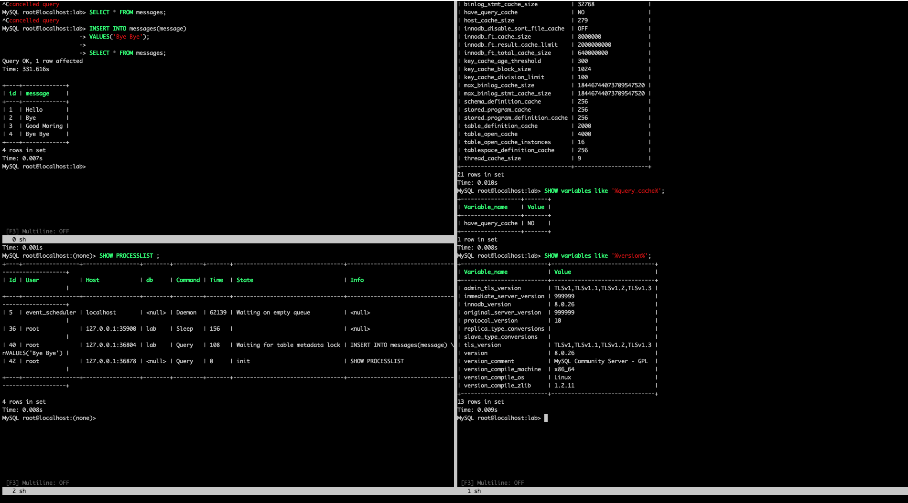
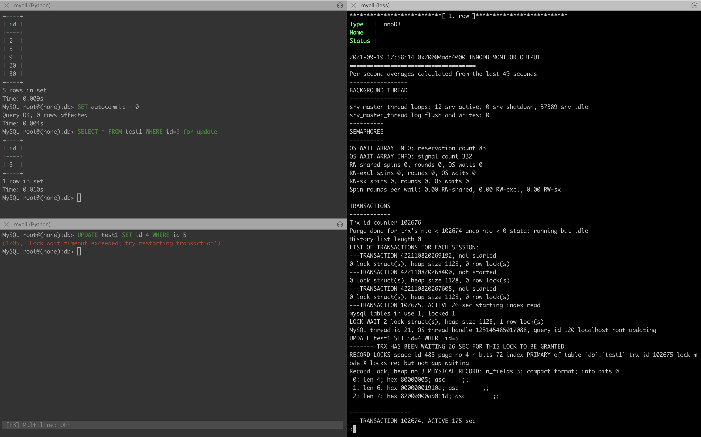

# 0x07-01 系统性能优化


> 工欲善其事，必先利其器！ 学会使用工具可以提升工作效率。


## 1. MySQL 事务与锁<sup>*</sup>

* 事务可靠性ACID：

  * Atomicity: 原子性，一次事务中的操作要么全部成功，要么全部失败。

  * Consistency: 一致性，保证事务只能把数据库从一个有效（正确）的状态“转移”到另一个有效（正确）的状态。什么是数据库的有效(正确）的状态？

    > Consistency ensures that a transaction can **only bring the database from one valid state to another**, maintaining database [invariants](https://link.zhihu.com/?target=https%3A//en.wikipedia.org/wiki/Invariant_(computer_science)): **any data written to the database must be valid according to all defined rules, including [constraints](https://link.zhihu.com/?target=https%3A//en.wikipedia.org/wiki/Integrity_constraints), [cascades](https://link.zhihu.com/?target=https%3A//en.wikipedia.org/wiki/Cascading_rollback),[triggers](https://link.zhihu.com/?target=https%3A//en.wikipedia.org/wiki/Database_trigger), and any combination thereof.** This prevents database corruption by an illegal transaction, but does **not guarantee that a transaction is *correct*.**

  * Isolation：隔离性，可见性，保护事务不会互相干扰，包含4种隔离级别。

  * Durability： 持久性，事务提交成功后，不会丢数据。如电源故障，系统崩溃。

  > 关于一致性的理解：应用系统从一个正确的状态到另一个正确的状态，而ACID就是说事务能够通过AID来保证这个C的过程。C是目的，AID都是手段。

  * InnoDB：
    - 双写缓冲区、故障恢复、操作系统、fsync() 、磁盘存储、缓存、UPS、网络、备份策略 ......

* InnoDB Locking

  > 关于锁， [官网](https://dev.mysql.com/doc/refman/5.7/en/innodb-locking.html) 给出了详细的说明

  -

  

  * Shared and Exclusive Locks - row-level locks
    * A [shared (`S`) lock](https://dev.mysql.com/doc/refman/5.7/en/glossary.html#glos_shared_lock) permits the transaction that holds the lock to read a row.
    * An [exclusive (`X`) lock](https://dev.mysql.com/doc/refman/5.7/en/glossary.html#glos_exclusive_lock) permits the transaction that holds the lock to update or delete a row.
  * Intention Locks - *multiple granularity locking*

  * 表级锁

    * 意向锁: 表明事务稍后要进行哪种类型的锁定
      * 共享意向锁(IS): 打算在某些行上设置共享锁
      * 排他意向锁(IX): 打算对某些行设置排他锁
      * Insert 意向锁: Insert 操作设置的间隙锁
    * 其他
      * 自增锁(AUTO-IN)
      * LOCK TABLES/DDL

    

    -

    

    ```sql
    SHOW ENGINE INNODB STATUS;
    ```

  * 行级锁

    * 记录锁(Record): 始终锁定索引记录，注意隐藏的聚簇索引
    * 间隙锁(Gap): 锁住一个范围
    * 临键锁(Next-Key): 记录锁+间隙锁的组合;可“锁定”表中不存在记录
    * 谓词锁(Predicat): 空间索引

  * 死锁

    * 阻塞与互相等待
    * 增删改、锁定读
    * 死锁检测与自动回滚
    * 锁粒度与程序设计

* 事务的隔离级别 - Transaction Isolation Level

  * 并发事务带来的问题：
    1. 脏读
    2. 不可重复读
    3. 幻读

  * 《SQL:1992标准》规定了四种事务隔离级别(Isolation):

    1. 读未提交: READ UNCOMMITTED

       * 很少使用

       * 不能保证一致性

       * 脏读(dirty read) : 使用到从未被确认的数据(例如: 早期版本、回滚)

         

       * 锁：

         * 以非锁定方式执行
         * 可能的问题: 脏读、幻读、不可重复读

    2. 读已提交: READ COMMITTED

       * 每次查询都会设置和读取自己的新快照。

       * 仅支持基于行的 bin-log

       * UPDATE 优化: 半一致读(semi-consistent read)

       * 不可重复读: 不加锁的情况下, 其他事务 UPDATE 或 DELETE 会对查询结果有影响

       * 幻读(Phantom): 加锁后, 不锁定间隙，其他事务可以 INSERT

         

       * 锁：

         * 锁定索引记录, 而不锁定记录之间的间隙
         * 可能的问题: 幻读、不可重复读

    3. 可重复读: REPEATABLE READ

       * InnoDB 的默认隔离级别

       * 使用事务第一次读取时创建的快照

       * 多版本技术

         

       * 锁：

         * 使用唯一索引的唯一查询条件时，只锁定查找到的索引记录, 不锁定间隙。

         * 其他查询条件，会锁定扫描到的索引范围，通过间隙锁或临键锁来阻止其他会话在这

           个范围中插入值。

         * 可能的问题: InnoDB 不能保证没有幻读，需要加锁

    4. 可串行化: SERIALIZABLE

       * 最严格的级别，事务串行执行，资源消耗最大

  * [图解 MySQL 事务隔离级别](https://zhuanlan.zhihu.com/p/102883333)

  * 其他：

    * 事务隔离是数据库的基础特征。

    * 可以设置全局的默认隔离级别
    * 可以单独设置会话的隔离级别
    * InnoDB 实现与标准之间的差异

  * -

    
    
  * 问题回顾:

    * 脏读(dirty read) : 使用到从未被确认的数据(例如: 早期版本、回滚)
    * 不可重复读(unrepeated read): 不加锁的情况下，其他事务 update 会对结果集有影响
    * 幻读(phantom read): 相同的查询语句，在不同的时间点执行时，产生不同的结果集不同

* 日志 (`undo log`和`redo log`)

  * `undo log`: 撤销日志
    * 保证事务的原子性
    * 用处：事务回滚，一致性读、崩溃恢复
    * 记录事务回滚时所需的撤消操作
    * 一条 INSERT 语句，对应一条 DELETE 的 undo log
    * 每个 UPDATE 语句，对应一条相反 UPDATE 的 undo log
    * 保存位置：
      * system tablespace(MySQL 5.7 默认)
      * undo tablespaces(MySQL 8.0 默认)
    * 回滚段（rollback segment）
  * `redo log`: 重做日志
    * 确保事务的持久性，防止事务提交后数据未刷新到磁盘就掉线或崩溃
    * 事务执行过程中写入 redo log，记录事务对数据页做了哪些修改。
    * 提升性能: WAL(Write-Ahead Logging) 技术，先写日志，再写磁盘
    * 日志文件: ib_logfile0, ib_logfile1
    * 日志缓冲: innodb_log_buffer_size
    * 强刷: fsync()

  -

  

* MVCC：Multi-Version Concurrency Control （多版本并发控制）

  * 使 InnoDB 支持一致性读: READ COMMITTED 和 REPEATABLE READ
  * 让查询不被阻塞、无需等待被其他事务持有的锁，这种技术手段可以增加并发性能
  * InnoDB 保留被修改行的旧版本
  * 查询正在被其他事务更新的数据时，会读取更新之前的版本
  * 每行数据都存在一个版本号, 每次更新时都更新该版本
  * 这种技术在数据库领域的使用并不普遍。 某些数据库, 以及某些 MySQL 存储引擎都不支持

  > 聚簇索引的更新 = 替换更新
  >
  > 二级索引的更新 = 删除+新建

* MVCC 实现机制

  * 隐藏列

  * 事务链表， 保存还未提交的事务，事务提交则会从链表中摘除

  * Read view: 每个 SQL 一个, 包括 rw_trx_ids, low_limit_id, up_limit_id, low_limit_no 等

  * 回滚段: 通过 undo log 动态构建旧版本数据

    | 隐藏列 | DB_TRX_ID                       | DB_ROLL_PTR                               | DB_ROW_ID              |
    | ------ | ------------------------------- | ----------------------------------------- | ---------------------- |
    | 长度   | 6-byte                          | 7-byte                                    | 6-byte                 |
    | 说明   | 指示最后插入或更新该行的事务 ID | 回滚指针。指向回滚段中写入的undo log 记录 | 聚簇 row ID/ 聚簇 索引 |

* 演示事务与锁

  - 这里仅展示实验的部分截图，相关实验可以自行 Baidu 或 Google 复现。

  - 一些可能会用到的命令：

    ```sql
    SELECT CONNECTION_ID();
    SHOW ENGINE INNODB STATUS;
    SELECT * FROM performance_schema.data_locks;
    SHOW PROCESSLIST
    ```

    -

    

    -

    


## 2. DB 与 SQL 优化

* 从一个简单例子讲起

  -

  

  ```sql
  SELECT f_id, f_username, f_gender, f_idno, f_age, f_created_at, f_updated_at
  FROM dbsql.t_user_info
  WHERE f_id < 10
  ORDER BY IF(f_id < 5, -f_id, f_id);
  ```

* 说说 SQL 优化

  * 如何发现需要优化的 SQL？
  * 你了解的 SQL 优化方法有哪些？
  * SQL 优化有哪些好处？

* 模拟一个需求：

  * 虚拟业务组：

    * 业务分析人员: Tony
    * 开发攻城狮: Micheal
    * 著名DBA: Tijana
    * 此三人是某项目组的核心人员，承接了一个大型系统中某些模块的设计开发工作

  * 需求-1

    * 增加可以保存用户信息的数据表，必要的用户信息包含:

      > 表名:user_info
      >
      > 用户名 username 
      > 密码 password
      > 姓名 name
      > 性别 gender 
      > 身份证号 id_number
      > 年龄 age
      > 状态 state

      * 数据类型是否越大越好？

        -

        

      * 存储引擎的选择

        | InnoDB                                                 | ToKuDB                                                       |
        | ------------------------------------------------------ | ------------------------------------------------------------ |
        | 1. 聚焦索引<br/>2. 锁粒度是行锁<br/>3. InnoDB 支持事务 | 1. 高压缩比，尤其适用于压缩和归档(1:12) <br/>2. 在线添加索引，不影响读写操作<br/>3. 支持完整的 ACID 特性和事务机制 |
        | 没有其他特别因素就用 InnoDB                            | 归档库                                                       |

      * 设计的规范

        -

        

        * 设计表之前，通读 DBA 的指导手册/dbaprinciples

  * 需求-2

    >1.根据身份证号查询用户详细信息
    >
    >2.根据用户名密码登陆
    >
    >3.统计当日新增用户个数

    -

    

    * 小心隐式转换
      * 简单的 SQL 可能带来大的问题，where 条件中注意数据类型，避免类型转换

  * 需求-3

    > 系统经过一个月的运行，用户表增长约100万，DBA 接到告警， CPU 升高，查询越来越慢，请定位问题并给出解决方案。

    * 定位问题的方法：

      - 慢查询日志

        -

        

      - 看应用和运维的监控

        -

        

        -

        

    * 解决方案 

      * 通过查询日志吗，发现慢查询的SQL

      * 增加索引

        ```sql
        alter table table_name add index index_name(column_list);
        ```

      * 索引类型

        * Hash
        * B Tree/ B+ Tree

* 一些思考

  * 为什么主键要单调递增？
    * 避免过多的结点分裂

      -

      

  * 索引思考题

    * 为什么不适用 hash index
    * 为什么 b+tree 更适合做索引
    * 为什么主键长度不能过大

  * 谁快？ 为什么？

    > select * from t_user_info where f_id = XXX  // f_id:primary key
    >
    > select * from t_user_info where f_username=’XXX’  // f_username:index

    -

    

  * 字段选择性-最左原则

    * 某个字段其值的重复程度，称为该字段的选择性
    * F = DISTINCT(col)/count(*)

    -

    

  * 索引冗余

    > (username, name, age) : (username)、 (username, name)
    >
    > (username, name) : (username)、 (name, username)、 (name)
    >
    > (username): (username，id)

    * 长的包括短的，形成冗余
    * 有唯一约束的，组合冗余

  * 修改表结构的危害

    1. 索引重建
    2. 锁表
    3. 抢占资源
    4. 主从延时

  * 数据量

    1. 业务初期考虑不周，字段类型使用不合理，需要变更数据类型
    2. 随着业务的发展，需要增加新的字段
    3. 在无索引字段增加新的业务查询，需要增加索引

* 经验总结

  1. 写入优化
     * 大批量写入的优化
     * PreparedStatement 减少 SQL 解析
     * Multiple Values/Add Batch 减少交互
     * Load Data，直接导入
     * 索引和约束问题
  2. 数据更新
     * 数据的范围更新
     * 注意 GAP Lock 的问题
     * 导致锁范围扩大
  3. 模糊查询
     * Like 的问题
     * 前缀匹配
     * 否则不走索引
     * 全文检索
     * solr/ES
  4. 连接查询
     * 连接查询优化
     * 驱动表的选择问题
     * 避免笛卡尔积
  5. 索引失效
     * 索引失效的情况汇总
     * NULL，not，not in，函数等
     * 减少使用 or，可以用 union(注意 union all 的区别)，以及前面提到的 like
     * 大数据量下，放弃所有条件组合都走索引的幻想，出门左拐“全文检索”
     * 必要时可以使用 force index 来强制查询走某个索引
  6. 查询 SQL 到底怎么设计？
     * 查询数据量和查询次数的平衡
     * 避免不必须的大量重复数据传输
     * 避免使用临时文件排序或临时表
     * 分析类需求，可以用汇总表

## 3. 常见场景分析

* 怎么实现主键 ID

  - 自增
  - sequence
  - 模拟 seq
  - UUID
  - 时间戳/随机数
  - snowflake

* 高效分页

  - 分页:count/pageSize/pageNum, 带条件的查询语句
  - 常见实现-分页插件:使用查询 SQL，嵌套一个 count，性能的坑?
  - 改进一下1，重写 count
  - 大数量级分页的问题，limit 100000,20
  - 改进一下2，反序
  - 继续改进3，技术向:带 id
  - 继续改进4，需求向:非精确分页
  - 所有条件组合? 索引?

* 乐观锁与悲观锁

  ```sql
  select * from xxx for update;
  update xxx;
  commit;
  ```

  * 意味着什么？

  ```sql
  select * from xxx;
  update xxx where value=oldValue;
  ```

  * 为什么叫乐观锁


# 0x07-02 超越分库分表-高可用与读写分离


## 1. 从单机到集群

* 单机 MySQL 数据库的几个问题

  * 随着数据量的增大，读写并发的增加，系统可用性要求的提升，单机 MySQL 面临:
    1. 容量有限，难以扩容
    2. 读写压力，QPS 过大，特别是分析类需求会影响到业务事务
    3. 可用性不足，宕机问题

* 单机 MySQL 的技术演进

  -

  


## 2. MySQL 主从复制<sup>*</sup>

* 主从复制原理 - 核心

  * 核心：

    1. 主库写 binlog
    2. 从库 relay log

    -

    

  * 背景：

    * 2000年，MySQL 3.23.15版本引入了复制
    * 2002年，MySQL 4.0.2版本分离 IO 和 SQL 线程，引入了 relay log
    * 2010年，MySQL 5.5版本引入半同步复制
    * 2016年，MySQL 在5.7.17中引入 InnoDB Group Replication

* binlog 格式

  * ROW
  * Statement
  * Mixed

  -

  

* 主从复制原理

  * 异步复制：传统主从复制--2000年，MySQL 3.23.15版本引入了 Replication

    

  * 半同步复制：需要启用插件

    

  * 组复制：

    

* 主从复制演示

  1. 本地启动两个 MySQL
  2. 注意配置文件（思考几种安装、启动方式）
  3. 演示数据复制操作，创建表和写入、修改数据

  * [主从复制演示](https://github.com/KingQino/Geek/blob/main/Submission/Week7/%E8%B5%84%E6%BA%90%E5%87%86%E5%A4%87.md)

* 主从复制的局限性

  1. 主从延迟问题
  2. 应用侧需要配合读写分离框架
  3. 不解决搞可用问题

## 3. MySQL 读写分离<sup>*</sup>

* 主从复制在业务系统里的应用

  - 借助于主从复制，我们现在有了多个 MySQL 服务器示例

  - 如何借助这个新的集群，改进我们的业务系统数据处理能力？

    ==》 配置多个数据源，实现读写分离

* 读写分离 - 动态切换数据源版本 1.0

  1. 基于 Spring/Spring Boot，配置多个数据源(例如2个，master 和 slave)

  2. 根据具体的 Service 方法是否会操作数据，注入不同的数据源，1.0版本

  3. 改进一下1.1: 基于操作 AbstractRoutingDataSource 和自定义注解 readOnly 之类的，简化自动切换数据源

  4. 改进二下1.2:支持配置多个从库

  5. 改进三下1.3:支持多个从库的负载均衡

     [演示代码](https://github.com/KingQino/Geek/tree/main/Submission/Week7/week07/src/main/java/io/github/kingqino/week07/assignment9)

     -

     

* 读写分离 - 动态切换数据源版本 2.0

  1. 分析前一版本“动态切换数据源”有什么问题?

     - 侵入性还是较强
     - 降低侵入性会导致”写完读”不一致问题

  2. 改进方式，ShardingSphere-jdbc的Master-Slave 功能

     * SQL 解析和事务管理，自动实现读写分离
     * 解决”写完读”不一致的问题

     [演示代码](https://github.com/KingQino/Geek/tree/main/Submission/Week7/week07/src/main/java/io/github/kingqino/week07/assignment10)

     -

     

* 读写分离 - 动态切换数据源版本 3.0

  1. 分析前一版本“框架版本”有什么问题?
     * 对业务系统还是有侵入
     * 对已存在的旧系统改造不友好
  2. 改进方式，MyCat/ShardingSphere-Proxy 的 Master-Slave 功能
     * 需要部署一个中间件，规则配置在中间件
     * 模拟一个 MySQL 服务器，对业务系统无侵入

## 4. MySQL 高可用

* 为什么要高可用？

  * 读写分离，提升读的处理能力
  * 故障转移，提供 failover 能力

  * 加上业务侧连接池的心跳重试，实现断线重连，业务不间断，降低 RTO 和 RPO。
  * 注释：
    - Recovery Time Objective (RTO) ，指的是从灾难发生到整个系统恢复正常所需要的最大时长。
    - Recovery Point Objective (RPO)，指的是最多可能丢失的数据的时长。
  * 什么是 failover，故障转移，灾难恢复
    * 容灾:热备与冷备
    * 对于主从来说，简单讲就是主挂了，某一个从，变成主，整个集群来看，正常对外提供服务
  * 常见的一些策略：
    1. 多个实例不在一个主机/机架上
    2. 跨机房和可用区部署
    3. 两地三中心容灾高可用方案

* 高可用定义

  * 高可用意味着，更少的不可服务时间。一般用 SLA/SLO 衡量。

  * 注释：

    * Service Level Indicator (SLI): a metric and its target values (range) over a period of time
    * Service Level Objective (SLO): all SLIs representing the SLA objective
    * Service Level Agreement (SLA): legal agreement about SLO (e.g., how it is measured, notifications, service credits, etc.)

  * 比如提供的服务一年中允许中断停机的时常

    - 1年 = 365天 = 8760小时
    - 99 = 8760 * 1% = 8760 * 0.01 = 87.6小时
    - 99.9 = 8760 * 0.1% = 8760 * 0.001 = 8.76小时
    - 99.99 = 8760 * 0.0001 = 0.876小时 = 0.876 * 60 = 52.6分钟
    - 99.999 = 8760 * 0.00001 = 0.0876小时 = 0.0876 * 60 = 5.26分钟

  * 后面的分布式课程讲稳定性，注意关系和区别。

    > 你维护的系统有几个9?99.95%算是几个9?

* MySQL 高可用0: 主从手动切换

  * 如果主节点挂掉，将某个从改成主

  * 重新配置其他从节点

  * 修改应用数据源配置

    ==》有什么问题？

    1. 可能数据不一致
    2. 需要人工干预
    3. 代码和配置的侵入性

* MySQL 高可用1: 主从手动切换

  * 用 LVS+Keepalived 实现多个节点的探活+请求路由。

  * 配置 VIP 或 DNS 实现配置不变更。

    ==》有什么问题？

    1. 手动处理主从切换
    2. 大量的配置和脚本定义

* MySQL 高可用2: MHA

  * MHA(Master High Availability)目前在 MySQL 高可用方面是一个相对成熟的解决方案，它由 日本 DeNA 公司的 youshimaton(现就职于 Facebook 公司)开发，是一套优秀的作为 MySQL 高可用性环境下故障切换和主从提升的高可用软件。

  * 基于 Perl 语言开发，一般能在30s内实现主从切换。 切换时，直接通过 SSH 复制主节点的日志。

    ==》有什么问题？

    1. 需要配置 SSH 信息
    2. 至少三台

    -

    

* MySQL 高可用3: MGR<sup>*</sup>

  * 如果主节点挂掉，将自动选择某个从改成主; 

  * 无需人工干预，基于组复制，保证数据一致性

    ==》 有什么问题？

    1. 外部获得状态变更需要读取数据库
    2. 外部需要使用 LVS/VIP 配置

    -

    

  * **MySQL Group Replication**( **MGR** )的特点：
    * 高一致性:基于分布式 Paxos 协议实现组复制，保证数据一致性;
    * 高容错性:自动检测机制，只要不是大多数节点都宕机就可以继续工作，内置防脑裂保护机制;
    * 高扩展性:节点的增加与移除会自动更新组成员信息，新节点加入后，自动从其他时间节点同步增量数据，直到与其他数据一致;
    * 高灵活性:提供单主模式和多主模式，单主模式在主库宕机后能够自动选主，所有写入都在主节点进行，多主模式支持多节点写入。

* MySQL 高可用 4: MySQL Cluster

  * 

    

  * **MySQL InnoDB Cluster**

    * MySQL Shell是MySQL 团队打造的一个统一的客户端，它可以对MySQL 执行数据操作和管理。它支 持通过JavaScript，Python， SQL 对关系型数据模式和文档行数据模式进行操作。使用它可以轻松配置管理 InnoDB Cluster。
    * MySQL Router 是一个轻量级的中间件，可以提供负载均衡和应用连接的故障转移。它是MySQL团队 为MGR量身打造的，通过使用Router 和Shell，用户可以利用MGR实现完整的数据库底层的解决方案。 如果您在使用MGR，请一定配合使用Router 和Shell，您可以理解为它们是为MGR而生的，会配合 MySQL的开发路线图发展的工具。

  * MySQL 高可用5: Orchestrator

    * 如果主节点挂掉，将某个从改成主;

    * 一款 MySQL 高可用和复制拓扑管理工具，支持复制拓扑结构的调整，自动故障转移和手动主从切换等。 后段数据库 MySQL 或 SQLite 存储元数据，并提供 Web 界面展示 MySQL 复制的拓扑关系及状态， 通过 Web 可更改 MySQL 实例的复制关系和部分配置信息，同时也提供命令行和 API 接口，方便运维 管理。

    * 特点

      1. 自动发现 MySQL 的复制拓扑，并且在 Web 上展示;
      2. 重构复制关系，可以在 Web 进行拖图来进行复制关系变更;
      3. 检测主异常，并可以自动或手动恢复，通过 Hooks 进行自定义脚本;
      4. 支持命令行和 Web 界面管理复制

    * 基于 Go 语言开发，实现了中间件本身的高可用(?!)

    * 优势: 能直接在 UI 界面拖拽改变主从关系

      -

      

  


